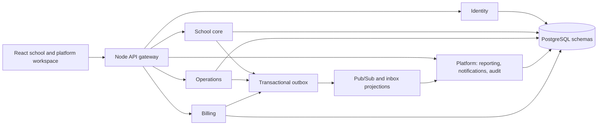

**Custoking IMS — product assessment, 26 September 2026**

Follow-up: [implementation results and remaining external acceptance items](PRODUCT-FINDINGS-REMEDIATION-2026-09-26.md). The findings below describe the pre-fix baseline.

Method: repository and local verification; independent dual-agent UX assessments (A: `/root/ux_assessment_a`; B: `/root/ux_assessment_b`).

Custoking IMS has a credible product opportunity in connecting everyday school administration with managed procurement. The implementation contains considerable domain knowledge and engineering controls. Its most consequential weaknesses are financial correctness, truthful completion states, and recovery when a workflow is interrupted or only partly succeeds. These need attention before expanding the product promise or onboarding volume.

This assessment covers the working tree on branch `fix/sa-portal-dead-controls-and-dialogs`, based on commit `7cde0c76`, including pre-existing uncommitted changes. It is not a certification of the deployed production revision. Current source takes precedence over the May PRD and August launch documents. Strategic conclusions below are hypotheses inferred from the product, not customer research or evidence of willingness to pay.

**1. Product identity and the value proposition**

The application has two connected product groups: ERP and Supply OS. ERP covers students, attendance, fees, staff, timetable, and related administration. Supply OS covers requirements, catalog orders, urgent procurement, approvals, delivery, and platform invoicing. The navigation and entitlement model make this split explicit in [workspace/config.ts](../frontend/src/pages/workspace/config.ts).

Its strongest potential story is: a school maintains reliable operational records, uses those records to define requirements, and completes procurement through an accountable approval and fulfillment process. For example, accurate enrollment and approved student photos can inform ID-card work; recurring annual requirements can support notebook and uniform procurement. These are opportunities to connect workflows; their existence as fully automated links is not established by this review.

The notebook workflow is particularly specific. It captures dimensions, ruling choices, printed pages, aggregate quantity rules, rounding, pricing ownership, artwork, approval, and delivery evidence. An order retains its form and rule snapshot. Schools submit requirements, while superadmin owns quotes and final approval. This is deeper than a generic order table and is a credible source of differentiation. See [CatalogOrderFormService.java](../services/school-core-service/src/main/java/com/custoking/ims/schoolcoreservice/persistence/CatalogOrderFormService.java) and [the confirmed notebook specification](product/notebook-order-form-builder.md).

The likely best-fit customer, inferred from the workflows, is a school or school group whose administration and procurement still require significant staff coordination and who values an assisted service relationship. The product owner must still establish the segment, buying authority, purchase frequency, migration burden, and willingness to pay through actual school use.

There are three distinct stakeholder needs:

| Stakeholder | Desired outcome | Product implication |
|---|---|---|
| Principal or school owner | Reliable records, controlled spending, fewer unresolved operational issues | Accurate summaries, accountable approvals, accessible history |
| Teacher, clerk, accountant, school administrator | Finish repeated daily work quickly and recover from interruptions | Fast task entry, preserved context, safe retries, clear exceptions |
| Custoking operations and platform administrators | Onboard and serve multiple schools efficiently | School assignment, work queues, fulfillment evidence, exception ownership |

Custoking is both platform operator and a participant in procurement workflows. The urgent-request UI explicitly highlights a Custoking quotation. Commercial involvement should be transparent: selection criteria, who recommended a quote, who approved it, and why should be distinguishable. Do not describe the quote recommendation as a demonstrated automated evaluation engine; the inspected source stores recommendation fields, but this review did not establish the claimed quantity/deadline/budget/GST evaluation path.

**2. Capability depth is uneven**

| Capability | Evidence of implementation | Product assessment |
|---|---|---|
| School administration | Schools, structure, academic years, entitlements, scoped users | Substantial foundation; onboarding remains operationally assisted |
| Student lifecycle | Admission, bulk import, photos, verification, export, deletion safeguards, guardian consent | Broad and operationally specific; partial-save recovery needs work |
| Attendance | Section rosters, marking, reports, history, absentee notification queue | Substantial implementation; provider delivery is a separate readiness gate |
| Fees | Plan publication/revisions, assignments, installments, discounts, late fees, payment records, receipts | Deep functionality with important correctness defects described below |
| Structured catalog orders | Server-owned rules and snapshots, quotation, artwork, final approval, delivery gates | Strongest differentiated workflow inspected |
| Urgent procurement | Draft, quotations, bursar/principal/platform approvals, fulfillment and vendor-paid stages | Meaningful workflow, but quotation document storage is incomplete |
| Timetable and staff | Dedicated panels and backend repositories | Functional scope exists; this review did not establish comprehensive HR/payroll capability |
| Platform billing | Invoice and payment records, PDFs, statistics | Useful operational billing; analytics calculations require correction |
| Communication | Consent policy, notification inbox, retries, provider adapters, delivery states | Technical depth exceeds the capabilities honestly available through some UI controls |
| Zone administration | Navigation destinations exist | Both zone workspace destinations currently render a coming-soon view |
| Sign-in and recovery | Password login, cookie refresh, role-aware session | Google/Microsoft controls are stubs; self-service password recovery is not implemented in the reviewed flow |
| Command center | Action records, feeds, dashboard insights, action acceptance | Useful presentation, but completion and AI-related claims need stronger evidence |

A seeded permission or PRD endpoint does not prove a complete feature. In particular, `fee:reverse` exists in permission migrations, but no implemented fee reversal/refund workflow was identified in the inspected API and UI. Similarly, payment recording is not evidence of an integrated online collection gateway. These distinctions should appear in sales and release scope.

**3. Financial correctness: highest priority findings**

The fee repository uses integer paise for monetary values, validates positive amounts, and rejects a single payment exceeding the observed balance. Those are useful controls. They do not cover all real collection scenarios.

**F1 — duplicate logical payments are accepted. P1, high confidence, locally reproduced.** The payment DTO and handlers have no idempotency key, and `recordPayment` generates a new UUID on every call. A network timeout after a successful write followed by a retry can therefore record the same payment again if enough balance remains. In a disposable PostgreSQL fixture, two identical requests for 10,000 paise produced two distinct payment records and 20,000 paise paid. This was a repository-level probe inside Spring transactions, not a production request. See [FeeReadRepository.java, recordPayment](../services/school-core-service/src/main/java/com/custoking/ims/schoolcoreservice/persistence/FeeReadRepository.java#L1046).

Required outcome: one logical collection produces one payment and one stable receipt even after a timeout, retry, refresh, or duplicate submit. Bind the key to tenant and operation, validate repeated-payload consistency, and return the original result. Request/button disabling alone cannot provide that guarantee.

**F2 — a prior-year fee assignment can be rewritten into the current year. P1, high confidence, locally reproduced.** If there is no current-year assignment, the lookup falls back to the latest assignment from any year. The later update sets that assignment's `academic_year_id` to the current academic year. A synthetic assignment moved from `1999-2000` to `ay_2026_27` after recording a payment. Historical debt should be settled against its original assignment or moved through an explicit, auditable carry-forward operation. See the fallback and update within [FeeReadRepository.java](../services/school-core-service/src/main/java/com/custoking/ims/schoolcoreservice/persistence/FeeReadRepository.java#L1071).

**F3 — concurrent collections need a dedicated integrity test. P1, source-confirmed risk; concurrent outcome not reproduced.** The balance read, validation, insert, and increment do not lock the assignment or condition the update on the remaining balance. Late-fee recalculation only writes when its computed amount changes, so it is not a reliable lock. Two collectors can potentially both validate against the same balance. Add a transactional row lock or atomic conditional update and prove behavior with simultaneous requests. Receipt numbers also use milliseconds and have a nonunique index; establish collision-safe numbering and a database uniqueness guarantee.

**F4 — payment attribution differs between API paths. P1, source-confirmed.** The canonical fee controller overwrites `actorId` with the authenticated user. The compatibility controller forwards the caller's map directly, and the repository reads `actorId` from it. An authorized caller can therefore supply misleading attribution through that path. Normalize actor identity at the trusted boundary for every alias. This is an audit-integrity concern, not a claim of an observed cross-school data leak. See [FeeReadController.java](../services/school-core-service/src/main/java/com/custoking/ims/schoolcoreservice/api/FeeReadController.java#L359) and [FeePublicCompatibilityController.java](../services/school-core-service/src/main/java/com/custoking/ims/schoolcoreservice/api/compat/FeePublicCompatibilityController.java#L264).

**F5 — revenue statistics are incorrectly scoped. P1, source-confirmed.** `BillingInvoiceRepository.stats()` reads at most the latest 500 invoices. It returns their count as `sentThisMonth` without filtering by month and sums only those rows for total invoiced. Thus the month label is inaccurate even at low volume, and fleet totals become incomplete above 500 invoices. Compute aggregates in SQL with explicit date bounds and scope. The UI already calls total invoiced GMV; retain that distinction and separately measure realized revenue, cash collected, supplier cost, and margin. See [BillingInvoiceRepository.java](../services/billing-service/src/main/java/com/custoking/ims/billingservice/persistence/BillingInvoiceRepository.java#L59).

**4. Trust: the interface must describe actual state**

**T1 — broadcast sending is presented as available even though the backend refuses it. P1, source-confirmed.** `NotificationBroadcastCommandRepository.send()` always throws until communication category and recipient policy evidence are recorded. That backend restriction is intentional. The dashboard nevertheless immediately adds “Broadcast sent” to its activity feed and shows a queued success message before the request resolves. Its error handler restores part of the broadcast state but leaves the optimistic feed item. Preserve the policy restriction; show an unavailable action with a clear prerequisite or a truthful supported draft workflow. See [NotificationBroadcastCommandRepository.java](../services/platform-service/src/main/java/com/custoking/ims/platformservice/persistence/NotificationBroadcastCommandRepository.java#L70) and [HomePanel.tsx](../frontend/src/pages/workspace/panels/HomePanel.tsx#L1271).

**T2 — accepting a suggestion is described as executing work. P1, source-confirmed.** An ordinary suggestion CTA accepts the action and navigates to a panel. The handler adds “Executed” before success. The backend acceptance operation changes the action's status; it does not prove the underlying fee, student, or procurement task was completed. Separate review, acceptance, execution, and verified completion. The “Why this?” button also has no handler. “AI · RANKED” and confidence claims should be explainable in terms of evidence, freshness, ranking method, and uncertainty. No operational model-backed ranking pipeline was established by this review. See [HomePanel.tsx](../frontend/src/pages/workspace/panels/HomePanel.tsx#L632).

**T3 — quotation file selection is styled as a completed upload. P1, source-confirmed.** The urgent-procurement form stores `file.name` in `documentUrl` and shows “uploaded.” A nearby note says only the filename is stored. The disclaimer does not make the success claim reliable. Implement private document persistence and retrieval, or label the control as a filename/reference field until that capability exists. See [FirefightingNewPanel.tsx](../frontend/src/pages/workspace/panels/FirefightingNewPanel.tsx#L252).

**T4 — the sign-in screen promises unsupported paths. P1, source and login-browser evidence.** Google and Microsoft invoke a stub; “Forgot password?” is disabled; support points to `it@yourcompany.com`; system status is static. Authentication guidance should match the actual configured capability. A staff member locked out during attendance needs a real recovery route, not an attractive dead end. See [LoginPage.tsx](../frontend/src/pages/LoginPage.tsx#L136).

The shared principle is precise state language: selected, saved, submitted, accepted, queued, sent, delivered, failed, and completed describe different facts. Each should have a corresponding authoritative backend event or response.

**5. UX: make interrupted work recoverable**

The product has a recognizable operational vocabulary, consistent surfaces, role-specific navigation, helpful loading/error states, bulk tools, and useful domain safeguards. Its mobile navigation drawer demonstrates deliberate focus management. The most valuable design improvement is reducing uncertainty during work.

**U1 — weak continuity across interruptions. P1.** The workspace uses local React panel state and conditional mounting. A panel is not represented by a stable task URL. Refresh, browser Back, bookmarking, support links, and interrupted forms therefore have weak continuity. Give important panels and records addressable routes; preserve filter/selection state; protect dirty forms or save recoverable drafts. This is source-backed for admission and workspace navigation; legacy attendance-component observations were not generalized to the current attendance module.

**U2 — partial admission success cannot be recovered cleanly. P1.** The UI creates a student and then uploads the photo in a single try/catch. If the second step fails, the form still looks unsaved; retrying Save attempts creation again. Preserve the created student ID and explain “Student saved; photo upload failed,” with an upload-only retry. See [AddStudentPanel.tsx](../frontend/src/pages/workspace/panels/AddStudentPanel.tsx#L185).

**U3 — accessibility varies between shared components. P1.** The shared Modal lacks dialog semantics, focus entry/trapping/restoration, Escape behavior, and an accessible close label. The shared Field renders a label beside its control without associating them. Dashboard drawers have some semantics and Escape handling but lack the workspace drawer's complete focus behavior. These are source-confirmed gaps, not a completed screen-reader compliance audit. Consolidate accessible primitives rather than repairing each dialog independently. See [Modal.tsx](../frontend/src/components/Modal.tsx), [workspace/ui.tsx](../frontend/src/pages/workspace/ui.tsx#L30), and [CommandCenterDrawer.tsx](../frontend/src/pages/workspace/dashboard/components/CommandCenterDrawer.tsx).

The desktop sidebar defaults to hidden labels. A first-time operator must learn icons before the information architecture is familiar. A full-module administrator has seven Supply OS items and seven ERP items; the dashboard adds overlapping KPIs, Action Insights, suggestions, broadcasts, and feed. These are separate groups, not a single enormous decision. Nevertheless, daily task priority can become unclear. Start with a role-specific answer to “What must I finish today?” and reveal secondary analysis when needed.

The experience begins calmly, but unavailable login help, lost work, and ambiguous completion are emotional low points. Domain-specific vocabulary and progress feedback restore confidence; clear recovery and trustworthy completion are what will sustain daily adoption.

The provisional UX assessment is **20/40**. These are expert review scores from source, login inspection, and existing screenshot fixtures; they are not measured customer usability scores.

| Heuristic | Score / 4 | Main evidence |
|---|---:|---|
| Visibility of system status | 2 | Loading/error states exist; premature execution/sent claims |
| Match to real world | 3 | Strong school vocabulary; some unexplained AI/ERP terminology |
| User control and freedom | 2 | Weak task-location and unsaved-work continuity |
| Consistency and standards | 2 | Shared visual shell, inconsistent dialogs |
| Error prevention | 2 | Good deletion/validation safeguards, weak partial-success handling |
| Recognition rather than recall | 2 | Hidden navigation labels and unaddressable panel state |
| Flexibility and efficiency | 2 | Bulk operations help; task linking/history remains limited |
| Aesthetic and minimalist design | 2 | Calm surfaces; overlapping dashboard decision areas |
| Error recovery | 2 | Retry patterns exist; admission and login recovery gaps |
| Help and documentation | 1 | Local guidance exists; global access-help path is incomplete |
| **Total** | **20/40** | **All ten heuristics apply; provisional assessment** |

Persona checks reinforce the priorities. A power user benefits from bulk tools but loses place across interruptions. A keyboard user encounters different focus behavior in navigation and forms. A new school administrator sees reassuring login controls that cannot resolve an access problem. These are usability hypotheses grounded in implementation, not observed customer abandonment.

The independent detector scanned 92 markup candidates under `frontend/src/pages` and produced three warnings: a side accent border in `ActionInsightCard.tsx:42`, and width animations in `LowAttendanceDrawer.tsx:29` and `StudentReviewDrawer.tsx:53`. The border reflects meaningful module color coding and is a contextual false positive for a generic-design claim. Width animation is a P3 optimization candidate; no runtime jank was measured. These three mechanical warnings do not capture the higher-impact workflow and accessibility issues.

**6. Architecture: a strong foundation with concentrated complexity**

The actual stack is React/TypeScript/Vite, a Node gateway, and five Java 25/Spring Boot 4.1.1 services. It differs substantially from the old PRD's monolith, frontend-library choices, and RLS decisions.

This is a repository topology sketch; it is not a fresh cloud-resource inventory. Shared PostgreSQL does not mean every service is permitted to query every schema. Ownership and runtime-boundary checks remain important.

Strengths include application tenant scope plus PostgreSQL RLS, runtime-role guards, tenant state reset on pooled connections, private service authentication, suppression of client-supplied identity headers, permission/entitlement checks, hashed refresh tokens with rotation/reuse detection, outbox/inbox delivery, projection deduplication, retries, and forward migrations. The current source also blocks internal/Pub/Sub paths through gateway aliases. These controls materially improve the engineering baseline.

The gateway verifies enriched access-token claims locally. This avoids an identity round-trip, but role/permission/operator-school claims can remain valid until token expiry; the default access lifetime is 15 minutes. Logout revokes the refresh family, while the local access-token path does not consult that family. Define the required emergency-disable behavior and implement revocation/version checking where immediate removal is necessary. This is a visible architectural tradeoff, not a claim of a production incident.

The gateway's token-bucket rate limiter is process-local and primarily keyed by bearer-token digest or IP. It is not a globally coordinated school quota across replicas. Treat fleet-level fairness, unauthenticated login abuse controls, and resource-heavy imports as separate capacity requirements.

Service decomposition has not eliminated large modules. `StudentReadRepository.java` is about 3,557 lines and `FeeReadRepository.java` about 2,015; both contain mutation/business behavior despite their names. `HomePanel.tsx` is about 1,485 lines and `StudentsPanel.tsx` about 1,401. Concentrated state, SQL, validation, and rendering make transactional and error-state reasoning harder. Extract coherent business operations and UI state machines around proven pain points. Another service split is not the immediate remedy.

The generated inventory records 410 controller mappings: 313 canonical, 90 compatibility, and seven internal, plus 12 diagnostic aliases. These are generator classifications, not 410 independently verified public endpoints. The frontend still has 95 compatibility calls across 21 files. Only three identity operations are currently covered by the checked generated OpenAPI client. This leaves considerable contract and validation work outside generated typing.

**7. Performance, operations, and readiness**

The production frontend build succeeds with useful lazy-loaded panels. Its main JS asset is about 245 kB, 83 kB gzip, and shared CSS about 185 kB, 30 kB gzip. ExcelJS and SheetJS produce approximately 940 kB and 500 kB chunks; they are separate chunks, so these sizes should not be presented as an initial-page download measurement. Measure actual import/export journeys on representative school devices before optimizing.

There are inspectable query risks. Fee summary/report paths refresh late fees across assignments and then fetch installment details per assignment. That increases work with tenant size and can introduce writes during reads. Prioritize query-count and latency measurement for morning attendance, student search, class fee reports, and import/export contention. Large student-row counts and a healthy homepage are insufficient evidence for simultaneous school-day traffic.

CI includes frontend tests/build/browser tests, Java tests, architecture/security checks, and release workflows using digest promotion and verification. The September security completion record reports deployed fixes and identifies branch protection as outstanding at that time. August documents include scale rehearsals, a roughly 604-second PITR-clone drill, and unresolved named-school/capacity/governance decisions. These are valuable dated observations. This review did not re-query live IAM, branch rules, SQL sizing, notification configuration, or deployment revisions, so historical gaps must be rechecked before being called current production defects.

Repository defaults and manifests retain logging/dry-run communication modes. Consent and provider plumbing are real; end-recipient delivery must be evidenced separately. The general broadcast path remains blocked in current source regardless of provider configuration. A real-school acceptance exercise should include observed attendance, fees, imports, document retrieval, communication outcomes, and recovery, with a named support owner.

**8. Commercial focus and measurement**

Feature breadth is ahead of evidence for a repeatable operating and commercial model. The inspected revenue screen measures invoice counts and GMV; it does not answer whether Custoking earns money serving a school. The review found substantial technical telemetry, but did not identify a dedicated product-adoption event layer in the inspected frontend. Domain/audit data could still support adoption measurement; absence of a third-party analytics SDK is not itself a defect.

A practical product model should distinguish:

- Recurring software value: reliable school records, daily operations, access control, reporting.
- Procurement value: specification accuracy, fewer approval delays, fulfillment reliability, supplier coordination.
- Implementation/service cost: imports, photo correction, onboarding, support, approvals, exception handling.

Useful success measures are time to first reconciled import, time to first independently completed attendance session, weekly active staff by role, recoverable-save success, fee correction rate, requirement-to-quote time, approval aging, on-time fulfillment, repeat procurement by school, and support minutes per active school. Commercial measures should separate subscription income, GMV, gross margin, cash collection, and cost to serve. Proposed metrics are not claims that these outcomes have been measured.

The approval design also creates a scaling dependency on Custoking staff. Keeping pricing and final approval centrally owned may be correct, but queues need ownership, aging, escalation, and documented delegation. Otherwise more schools can create more manual backlog even when the software scales technically.

For the next product commitment, select one complete outcome: for example, a school's requirements moving through quote, approval, evidence, delivery, and reconciliation. Make the required ERP data dependable in support of that outcome. A broad ERP rollout can follow evidence that schools independently complete their daily work and return without operator assistance.

**9. Prioritized improvement plan**

These are proposed acceptance gates, not promised calendar estimates.

| Stage | Work | Acceptance evidence |
|---|---|---|
| A — financial integrity | Payment idempotency, historical-year preservation, concurrent-balance protection, receipt uniqueness, trusted actor identity, invoice aggregates | Duplicate and simultaneous requests cannot double-record/overpay; historic assignments retain their year; statistics reconcile across periods and more than 500 invoices |
| B — honest, recoverable workflows | Broadcast/AI/upload/login claims, partial student saves, task URLs, dirty-state recovery, accessible primitives | Every success state corresponds to persisted evidence; failed second steps can be retried without repeating completed steps; keyboard paths work |
| C — one complete school outcome | Named cohort, import reconciliation, core daily operation, procurement delivery, support and recovery | A school completes the selected journey independently; exceptions have owners; restore and communication outcomes are observed |
| D — evidence-led expansion | Query bottlenecks, school-day arrival-rate capacity, current governance verification, product metrics, targeted module refactoring | Measured peak workload and cost fit the operating envelope; adoption/support data guide the next module |

For UX work, the relevant follow-up skill commands are `impeccable harden` for recovery/state handling, `impeccable clarify` for truthful capability/status language, and `impeccable audit` for keyboard/form behavior. Cosmetic polish comes after those fixes. This assessment does not implement them.

**10. Verification performed**

| Check | Result on 26 September 2026 |
|---|---|
| Full Java reactor, `mvnw.cmd -B test` | 1,369 tests, zero failures/errors/skips; all five services passed |
| Frontend Vitest | 282 tests across 54 files passed |
| Frontend production build | Passed; large spreadsheet chunks noted above |
| Standard gateway `npm test` | Stops on generated inventory freshness check |
| Direct gateway tests | All 83 passed |
| Inventory semantic comparison | Counts and definitions match; only recorded source line numbers differ |
| Generated OpenAPI client check | Passed, covering three identity operations |
| Runtime and service-authorization boundary audits | Passed |
| Seven guarded duplicated infrastructure classes | Consistent across services |
| Extra fee probe in disposable PostgreSQL | Confirmed duplicate logical-payment recording and historical-year rewrite |
| Browser evidence | Development login inspected in fresh tabs; existing authenticated screenshots reviewed as fixtures |

The passing suites are evidence of tested behavior, not proof that all business invariants are covered. The additional payment probe demonstrates that distinction. Authenticated end-to-end journeys, mobile interaction, real provider delivery, load capacity, assistive technology, and fresh production state were not independently verified in this run.

Application code and the user's pre-existing edits were preserved. Local verification logs and the fee-probe source are retained under ignored `artifacts/product-analysis-2026-09-26/`; no production writes or external messages were sent.

**Decisions for a follow-up**

Which improvement should lead: **financial correctness**, **operator recovery and accessibility**, or **procurement completion**? For the dashboard, should the primary experience be a **task queue**, a **school overview**, or a **switchable combination**?
