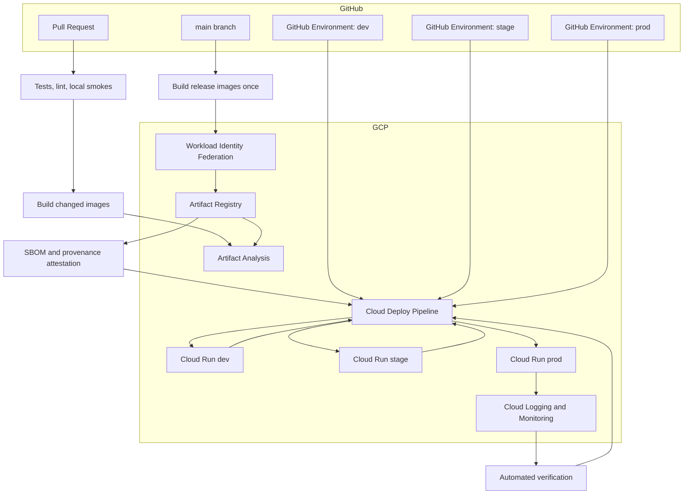
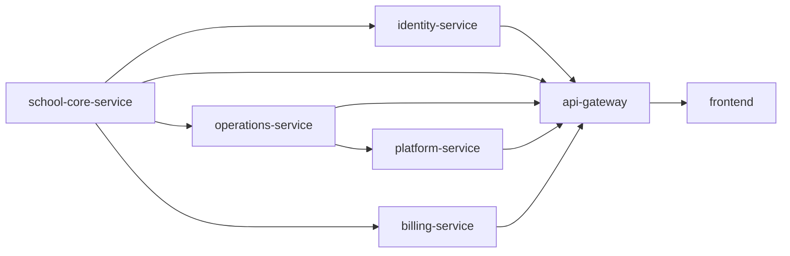
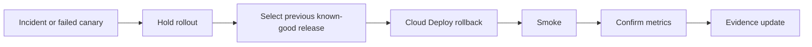

# CI/CD v2 Architecture Plan

Last updated: 2026-08-03.

Status: CI/CD v2 implementation files are present in-repo. Cloud resources must be imported/applied before the workflows are allowed to deploy production.

## Current Decision

The previous CI/CD implementation has been removed from the repository so nobody can accidentally trigger a stale deployment path while we rebuild the pipeline properly.

Removed active entrypoints:

- `.github/workflows/ci.yml`
- `.github/workflows/deploy.yml`
- `.github/workflows/release.yml`
- `.github/workflows/security-scan.yml`
- `cloudbuild.yaml`

The old model mixed too much responsibility into one Cloud Build file: image build, service wiring, Cloud Run deployment, smoke execution, evidence, and promotion behavior. It worked, but it was becoming hard to reason about, hard to secure tightly, and easy to drift between dev and prod.

The replacement is a split-brain-on-purpose model:

- GitHub Actions owns source events, tests, image builds, security evidence, and release creation.
- Google Cloud Deploy owns environment promotion, rollout order, canary traffic, verification, and rollback.
- Cloud Run stays the runtime platform.
- Artifact Registry stores immutable images.
- GitHub Environments and Google IAM decide who can promote what.

Implementation note: Google Cloud Deploy's Cloud Run target model supports one Cloud Run service, job, or worker pool per target. The implementation therefore uses one Cloud Deploy delivery pipeline per service, each with `dev`, `stage`, and `prod` targets. GitHub Actions coordinates the fleet order across those service pipelines.

## North Star

The pipeline should feel like a clean release board:


Simple rule: build once, promote the digest, never rebuild for prod.

## What This Fixes

| Problem in old path | v2 answer |
| --- | --- |
| Cloud Build file did build, deploy, service wiring, and smoke orchestration | Split responsibilities between GitHub Actions and Cloud Deploy |
| Prod promotion depended on convention around `_SKIP_BUILD=true` | Prod promotion uses immutable image digests from the same release |
| Rollback was possible but operationally manual | Cloud Deploy release/rollout history becomes the rollback control plane |
| Runtime config was generated inside shell-heavy deploy commands | Cloud Run service manifests become declarative and reviewable |
| Security evidence was scattered across jobs | One release evidence bundle per candidate |
| Dev/prod differences were easy to hide in workflow variables | Target-specific Cloud Deploy configuration makes drift visible |
| Long deploys consumed GitHub runner time | Google Cloud handles rollouts; GitHub creates and observes releases |

## Source Research

Only current official docs were used for the core decisions:

- GitHub documents OIDC for Google Cloud as a way for workflows to access GCP without long-lived credentials: [GitHub OIDC in Google Cloud](https://docs.github.com/en/actions/how-tos/secure-your-work/security-harden-deployments/oidc-in-google-cloud-platform).
- Google recommends Workload Identity Federation to avoid service account keys and restrict access using attribute mappings and conditions: [Google Workload Identity Federation](https://docs.cloud.google.com/iam/docs/workload-identity-federation).
- Google Cloud Deploy is built for delivery through a defined environment sequence: [Cloud Deploy overview](https://docs.cloud.google.com/deploy/docs).
- Cloud Deploy supports canary deployments for Cloud Run services: [Canary deployments to Cloud Run](https://docs.cloud.google.com/deploy/docs/deployment-strategies/canary/cloud-run).
- Cloud Run supports traffic migration and rollback between revisions: [Cloud Run rollouts and rollbacks](https://docs.cloud.google.com/run/docs/rollouts-rollbacks-traffic-migration).
- Cloud Deploy uses Skaffold to render deployable manifests: [Use Skaffold with Cloud Deploy](https://docs.cloud.google.com/deploy/docs/using-skaffold) and [Manage manifests in Cloud Deploy](https://docs.cloud.google.com/deploy/docs/using-skaffold/managing-manifests).
- Artifact Analysis supports vulnerability scanning for Artifact Registry images: [Artifact Analysis container scanning](https://docs.cloud.google.com/artifact-analysis/docs/container-scanning-overview).
- GitHub Actions can generate artifact attestations/provenance for container images: [GitHub artifact attestations](https://docs.github.com/en/actions/how-tos/secure-your-work/use-artifact-attestations/use-artifact-attestations).
- GitHub Environments support required reviewers, wait timers, branch restrictions, and custom protection rules: [GitHub deployments and environments](https://docs.github.com/en/actions/reference/workflows-and-actions/deployments-and-environments).
- GitHub reusable workflows and dependency caching are the intended primitives for a maintainable matrix CI setup: [Reusable workflows](https://docs.github.com/en/actions/how-tos/reuse-automations/reuse-workflows) and [Dependency caching](https://docs.github.com/en/actions/reference/workflows-and-actions/dependency-caching).

## Big Decisions

| Decision | Choice | Why |
| --- | --- | --- |
| CI orchestrator | GitHub Actions | Native PR feedback, repo-aware permissions, easy branch/environment policy |
| CD orchestrator | Google Cloud Deploy | Purpose-built promotion, canary, rollout history, Cloud Run target support |
| Runtime | Cloud Run | Existing platform; no need to introduce Kubernetes for this workload |
| Auth from GitHub to GCP | Workload Identity Federation/OIDC only | No JSON keys, short-lived credentials, attribute-conditioned access |
| Release artifact | Container image digest plus generated manifests | Digest cannot drift like a mutable tag |
| Deployment style | Declarative Cloud Run manifests rendered by Skaffold | Reviewable service config and repeatable target rendering |
| Prod rollout | Canary with automated verification and manual final approval | Safer than all-at-once promotion |
| Rollback | Cloud Deploy rollback to previous release/revision | Keeps rollback in the same control plane as deploy |
| Security | Shift-left checks plus registry scanning plus attestations | Catches obvious issues early and proves what was shipped |
| Cost posture | Build only changed services, cache dependencies, scale Cloud Run to zero where acceptable | Faster and cheaper without hiding release risk |

## Target Architecture



## Environment Model

Keep `dev` and `prod`. Add `stage`.

`stage` is not a luxury environment. It is the place where we rehearse production with production-like permissions, secrets shape, Cloud Run limits, migration order, Google Drive behavior, and smoke cleanup without touching real schools.

| Environment | Purpose | Trigger | Approval |
| --- | --- | --- | --- |
| `dev` | Fast integration after merge | Automatic after `main` release build | No manual approval |
| `stage` | Prod rehearsal and migration rehearsal | Automatic after dev smoke passes | Optional approval at first, then automatic |
| `prod` | Real users | Manual promotion from stage release | Required reviewer, branch restriction, no bypass |

Recommended naming:

- Cloud Run services: `custoking-<service>-<env>`
- Artifact Registry repo: `custoking`
- Delivery pipelines: `custoking-<service>`
- Cloud Deploy targets: `<service>-dev`, `<service>-stage`, `<service>-prod`
- Runtime service accounts: `custoking-<service>-runtime-<env>@...`
- Deployment service accounts: `custoking-cd-renderer-<env>@...`, `custoking-cd-deployer-<env>@...`

## Repository Layout

Create these files in the new implementation phase:

```text
.github/
  workflows/
    ci-pr.yml
    build-release.yml
    promote.yml
    rollback.yml
    _detect-changes.yml
    _test-java-service.yml
    _test-node-service.yml
    _build-image.yml
    _smoke-environment.yml

deploy/
  clouddeploy/
    delivery-pipelines.yaml
    targets-dev.yaml
    targets-stage.yaml
    targets-prod.yaml
  skaffold.yaml
  cloudrun/
    identity-service.yaml
    school-core-service.yaml
    operations-service.yaml
    platform-service.yaml
    billing-service.yaml
    api-gateway.yaml
    frontend.yaml

infra/
  terraform/
    cicd/
      github-oidc.tf
      artifact-registry.tf
      cloud-deploy.tf
      deploy-service-accounts.tf
      github-environment-notes.md

docs/
  runbooks/
    release-operator.md
    rollback.md
    cicd-break-glass.md
    deployment-evidence.md
```

## Workflow Set

### 1. PR CI: `.github/workflows/ci-pr.yml`

Purpose: give fast, specific feedback before merge.

Trigger:

- Pull request to `main`
- Manual dispatch for debugging

Jobs:

- Detect changed services.
- Run Java/Node/frontend tests only for affected units.
- Run global contract checks when shared packages, DB migrations, or deployment manifests change.
- Build changed Docker images locally or push to a short-retention preview namespace.
- Run Trivy on preview images.
- Run Gitleaks.
- Run dependency review where GitHub supports it.
- Upload a PR evidence summary.

PR CI does not deploy.

### 2. Release Build: `.github/workflows/build-release.yml`

Purpose: create one release candidate from `main`.

Trigger:

- Push to `main`
- Manual dispatch with `commit_sha`

Jobs:

- Resolve affected build units.
- Build all changed service images.
- Tag with:
  - `sha-<commit>`
  - `release-<github-run-id>`
  - optional semantic release tag when we add release notes.
- Push to Artifact Registry.
- Resolve immutable digests.
- Generate SBOM.
- Generate artifact attestations.
- Create Cloud Deploy release using image digests.
- Start rollout to `dev`.

No prod deploy happens from this workflow.

### 3. Promotion: `.github/workflows/promote.yml`

Purpose: promote an existing Cloud Deploy release through targets.

Trigger:

- Automatic dev -> stage after dev verification passes.
- Manual stage -> prod.
- Manual prod canary advance when required by policy.

Inputs:

- `release_id`
- `target`
- `canary_percent` when manually advancing
- `reason`

Rules:

- `dev` can promote automatically.
- `stage` can promote automatically after dev passes once the system is stable.
- `prod` requires GitHub Environment approval.
- `prod` can only promote releases already successful in `stage`.

### 4. Rollback: `.github/workflows/rollback.yml`

Purpose: make rollback boring.

Trigger:

- Manual dispatch only.

Inputs:

- `environment`
- `service` or `all`
- `rollback_to_release`
- `reason`

Actions:

- Calls Cloud Deploy rollback for the selected target.
- Runs smoke.
- Captures Cloud Run revisions before and after.
- Opens/updates an incident note in the release evidence artifact.

## Cloud Deploy Design

Use one delivery pipeline per service because Cloud Deploy Cloud Run targets support one Cloud Run service, job, or worker pool per target.

```text
custoking-school-core-service: school-core-service-dev -> school-core-service-stage -> school-core-service-prod
custoking-identity-service: identity-service-dev -> identity-service-stage -> identity-service-prod
custoking-operations-service: operations-service-dev -> operations-service-stage -> operations-service-prod
custoking-billing-service: billing-service-dev -> billing-service-stage -> billing-service-prod
custoking-platform-service: platform-service-dev -> platform-service-stage -> platform-service-prod
custoking-api-gateway: api-gateway-dev -> api-gateway-stage -> api-gateway-prod
custoking-frontend: frontend-dev -> frontend-stage -> frontend-prod
```

GitHub Actions coordinates multi-service release order across these pipelines.

Use Skaffold render with raw Cloud Run service manifests. Each manifest contains stable runtime configuration such as:

- Service name
- Region
- Runtime service account
- Container port
- CPU/memory
- Scaling caps
- VPC access
- Public/private ingress behavior
- Secret bindings by environment suffix
- Health check behavior

Image references are substituted by digest during release creation.

### Prod Canary Plan

Default production rollout:

```text
0 percent traffic: deploy revision, run direct smoke
5 percent traffic: watch core SLOs for 10 minutes
25 percent traffic: watch core SLOs for 20 minutes
100 percent traffic: final smoke and evidence bundle
```

Rollback triggers:

- Gateway 5xx rate above threshold.
- Domain service 5xx rate above threshold.
- P95 latency regression above threshold.
- Error logs with new deployment digest above threshold.
- Smoke failure.
- Migration verification failure.
- Manual stop by release operator.

Initial thresholds should be conservative and tuned after two weeks of real data.

## Service Rollout Order

The old Cloud Build file encoded service order in shell steps. In v2 the order becomes documented policy and Cloud Deploy orchestration.



Policy:

- Deploy `school-core-service` before services that depend on student/school context.
- Deploy domain services before gateway.
- Deploy gateway before frontend when frontend points to the gateway URL.
- For no-contract-change releases, services can be deployed independently.
- For DB or API contract releases, use expand/contract compatibility and promote as a coordinated release.

## Database Migration Policy

This is the part most teams under-design. We should make it strict now.

Rules:

- Migrations must be forward compatible for at least one release.
- No destructive migration in the same release that removes application fallback code.
- Every migration gets a dry-run against stage.
- Production migration creates a backup checkpoint or proves a recent usable backup exists.
- Rollback plan must say whether rollback is application-only or database-involved.
- Contract removals happen in a later release after production has run safely.

Release categories:

| Category | Example | Deploy mode |
| --- | --- | --- |
| App only | UI fix, API logic change | Normal canary |
| Additive DB | Add column/table/index | Normal canary after migration dry-run |
| Contract change | Rename field, change API shape | Coordinated release with compatibility window |
| Destructive DB | Drop column/table, rewrite data | Separate approved change window |

## Security Design

The pipeline should be boring to attack.

Controls:

- Default GitHub token permissions are read-only.
- Each workflow declares minimal permissions.
- OIDC requires `id-token: write` only in jobs that need GCP.
- No service account JSON keys in GitHub.
- Workload Identity Provider restricts by repository, branch, workflow, and GitHub Environment.
- Use separate deploy service accounts for dev, stage, and prod.
- Pin third-party actions by SHA for production paths.
- Secret scanning runs on PR and schedule.
- Dependency review runs on PR.
- Trivy blocks critical exploitable image vulnerabilities.
- Artifact Analysis scans images in Artifact Registry.
- SBOM and attestation are required before Cloud Deploy release creation.
- Prod promotion verifies the artifact digest was built by the trusted release workflow.

Minimum GitHub permissions:

```yaml
permissions:
  contents: read
```

Release jobs that authenticate to GCP add:

```yaml
permissions:
  contents: read
  id-token: write
  attestations: write
  packages: write
```

## IAM Model

Use narrow service accounts:

| Service account | Used by | Permissions |
| --- | --- | --- |
| `github-ci-reader` | PR CI | Read-only where possible; no prod access |
| `github-release-builder` | Release build | Push Artifact Registry images; create attestations; create Cloud Deploy releases |
| `clouddeploy-renderer` | Cloud Deploy render | Read Artifact Registry and deployment manifests |
| `clouddeploy-dev-deployer` | Dev target | Deploy only dev Cloud Run services/jobs |
| `clouddeploy-stage-deployer` | Stage target | Deploy only stage Cloud Run services/jobs |
| `clouddeploy-prod-deployer` | Prod target | Deploy only prod Cloud Run services/jobs |
| `smoke-runner-<env>` | Verification | Invoke services/jobs, read needed logs, create and delete smoke data |

Do not use broad Editor/Owner roles. If a predefined role is too wide, create a custom role after proving the exact permissions from audit logs.

## GitHub Environment Policy

| Environment | Branches | Reviewers | Wait timer | Secrets/vars |
| --- | --- | --- | --- | --- |
| `dev` | `main` | none | none | Dev-only vars |
| `stage` | `main` | optional platform reviewer | none | Stage-only vars |
| `prod` | `main` and release tags only | required owner/platform reviewer | 5-15 minutes | Prod-only vars |

Prod environment rules:

- Prevent self-approval.
- No admin bypass for normal releases.
- Restrict deployment branches.
- Require release reason in manual workflow input.
- Require linked evidence bundle.

## Cost Design

The old pipeline spent money in places that are easy to control.

Cost reductions:

- Build only changed images.
- Use dependency caching for Maven and npm.
- Use Docker layer caching where GitHub/GCP support it safely.
- Stop using Cloud Build as the always-on deployment script runner.
- Use Cloud Deploy for promotion and rollout state instead of repeated bespoke build submissions.
- Keep Cloud Run `min-instances=0` for dev and stage unless a service has a measured background-latency need.
- Use low max instance caps for dev/stage.
- Apply Artifact Registry cleanup policies.
- Keep source/archive buckets on lifecycle policies.
- Avoid scheduled full-fleet scans that rebuild everything; scan registry images instead.

Cost guardrails to add:

- Budget alert for CI/CD spend.
- Artifact Registry storage alert.
- GitHub Actions minutes review.
- Cloud Run min-instance drift check.
- Cloud Deploy release retention policy.
- Weekly report of unchanged services that were rebuilt.

## Runtime Performance Guardrails

CI/CD should protect API response time, not only deploy code.

Add deployment verification checks:

- Gateway `/health` and domain `/actuator/health`.
- Login/read smoke through gateway.
- Student list smoke for school login.
- Student photo smoke for one known test student with photo present.
- Google Drive integration config smoke in dev/stage.
- P95 latency comparison against previous release.
- Error-rate comparison by Cloud Run revision.
- Cold-start count and instance startup time tracking.

Do not block every deploy on every expensive scenario. Use tiers:

| Tier | Runs on | Checks |
| --- | --- | --- |
| Fast | PR | Unit tests, service tests, build, vulnerability gate |
| Release | main | Integration smoke, image scan, SBOM, attestation |
| Dev | dev rollout | Direct and gateway smoke |
| Stage | stage rollout | Migration rehearsal, photo smoke, Drive config smoke |
| Prod | prod canary | SLO watch, smoke, error budget guard |

## Student Photo Import Specific Gates

Because recent work touched Google Drive import, image size reduction, and lazy photo serving, the new pipeline should contain explicit photo checks.

Stage smoke should:

- Create a temporary school/school admin/student context.
- Provision or verify a stage Drive intake folder.
- Upload/import a tiny fixture image named like `_DSC4521.jpg`.
- Upload/import at least one `.jpeg`, `.jpg`, `.png`, and `.webp` if supported by product policy.
- Verify admission-number matching from mapping workbook to DB student.
- Verify duplicate school-name handling uses stable school identity, not name-only matching.
- Verify oversized image behavior uses reducer or clean failure.
- Verify frontend student tab returns data with photo references.
- Remove all test data and Drive fixture files.

Prod smoke should not import 1000 real files. It should do a tiny reversible smoke using a known test school and then clean up.

## Evidence Bundle

Each release should produce one durable folder/artifact:

```text
release-evidence/
  summary.md
  git.json
  images.json
  sbom/
  attestations/
  vulnerability-summary.json
  clouddeploy-release.json
  rollout-dev.json
  rollout-stage.json
  rollout-prod.json
  cloudrun-revisions-before.json
  cloudrun-revisions-after.json
  smoke-dev.json
  smoke-stage.json
  smoke-prod.json
  migration-report.json
  config-diff.md
  cleanup-report.json
```

The evidence summary should answer five questions quickly:

- What commit was shipped?
- What image digests were shipped?
- Who approved prod?
- What tests/smokes passed?
- How do we roll it back?

## Implementation Phases

### Phase 0: Retire Old Entry Points

Status: done in this branch.

The previous workflows and `cloudbuild.yaml` were removed so the repo cannot advertise a known-stale deployment path.

### Phase 1: Provision Foundation

Create infrastructure as code for:

- Workload Identity Federation pools/providers.
- GitHub OIDC attribute mappings and conditions.
- Artifact Registry scanning.
- Cloud Deploy delivery pipeline and targets.
- Environment-specific deploy service accounts.
- Minimal IAM bindings.
- GitHub Environment setup notes.
- Artifact cleanup policies.
- Budget and alert policies.

Deliverable: Terraform plan applied to dev/stage/prod foundation.

### Phase 2: Reintroduce PR CI

Add:

- Reusable test workflows.
- Path-aware service matrix.
- Maven/npm caching.
- Gitleaks.
- Trivy.
- Dependency review.
- Docker build validation.

Deliverable: PRs get fast feedback again, with no deployment.

### Phase 3: Build Release And Deploy Dev

Add:

- Release image build workflow.
- Digest manifest generation.
- SBOM and attestation.
- Cloud Deploy release creation.
- Automatic rollout to dev.
- Dev smoke and evidence artifact.

Deliverable: merge to `main` deploys to dev through Cloud Deploy.

### Phase 4: Add Stage And Prod Promotion

Add:

- Stage target and verification.
- Prod target with approval.
- Canary strategy.
- Rollback workflow.
- Migration rehearsal.
- Student photo smoke.

Deliverable: prod receives only releases that passed dev and stage.

### Phase 5: Enforce And Polish

Add:

- Required status checks.
- Branch protection.
- SHA-pinned actions.
- Scheduled registry scans.
- Drift detection.
- Cost reports.
- Release dashboard.

Deliverable: new CI/CD is the only supported path.

## Advanced Features To Add After Baseline

These are optional, but they are high-value once the baseline is stable:

- Custom GitHub Environment protection rule that checks Cloud Deploy release evidence before prod approval.
- SLO-based canary gate using Cloud Monitoring metrics.
- Automated config drift detector comparing Cloud Run live config to rendered manifests.
- Release freeze switch.
- Deployment calendar integration.
- Progressive delivery per service instead of full fleet.
- Preview environments for risky frontend or gateway PRs.
- Signed container policy enforcement.
- OpenSSF Scorecard check on scheduled runs.
- SLSA provenance verification before prod promotion.
- ChatOps command for `promote`, `hold`, `rollback`, and `status`.

## What We Might Be Missing

This is the checklist to review before implementation starts:

- Do we have a real `stage` database, or only dev/prod?
- Who approves production when the primary owner is unavailable?
- What is the maximum acceptable prod canary duration?
- What exact Cloud Monitoring metrics define rollback?
- Which services are allowed to scale to zero in prod?
- What is the retention period for deployment evidence?
- What test school is safe for prod smoke?
- How do we clean Google Drive test files after failed smokes?
- Do we need regional disaster recovery, or only rollback inside one region?
- Who owns secret rotation?
- Should DB migrations run as Cloud Run jobs, Cloud Deploy hooks, or a separate controlled workflow?
- Do we need a temporary break-glass deploy path for emergencies?
- Should `prod` deployments be blocked during school operating hours?

Default decision if nobody overrides:

- Add `stage`.
- Use Cloud Run jobs for migration and smoke helpers.
- Keep prod canary at 5 percent, 25 percent, 100 percent.
- Keep prod approval manual.
- Keep rollback manual but one-click.
- Keep dev automatic.
- Keep stage automatic after two successful manual rehearsals.

## First Implementation Ticket List

1. Add Terraform for WIF, deploy service accounts, Artifact Registry scanning, Cloud Deploy pipeline, and target IAM.
2. Add Cloud Run manifests for all seven deployable units.
3. Add `deploy/skaffold.yaml`.
4. Add Cloud Deploy pipeline and targets.
5. Add reusable GitHub test/build workflows.
6. Add PR CI.
7. Add release build workflow.
8. Add dev rollout and smoke.
9. Add stage rollout and smoke.
10. Add prod canary promotion.
11. Add rollback workflow.
12. Add release evidence bundle.
13. Add branch/environment protection checklist.
14. Add runbooks for release, rollback, break-glass, and evidence review.

## Rollback Policy

Rollback must be faster than deploy.

Rollback path:



Rollback rules:

- If prod canary fails before 100 percent, stop rollout and send traffic back to the previous revision.
- If prod fails after 100 percent, roll back to the previous successful Cloud Deploy release.
- If database migration is involved, follow the migration rollback note in the release evidence.
- Never roll forward blindly during an incident unless rollback is technically impossible.

## Break-Glass Policy

Break-glass exists, but it should be noisy.

Allowed only when:

- Production is down or data integrity is at risk.
- Normal Cloud Deploy path is unavailable.
- Two people agree in writing.
- The exact command and reason are recorded in the incident notes.

Break-glass should still deploy an existing trusted image digest. It should not build new code from a laptop.

## Final Shape

The final implementation should make this true:

```text
PR says: is this change safe to merge?
main says: build one release candidate.
dev says: does the system run together?
stage says: would this survive prod shape?
prod says: release slowly, watch closely, rollback quickly.
```

That is the CI/CD v2 contract.
