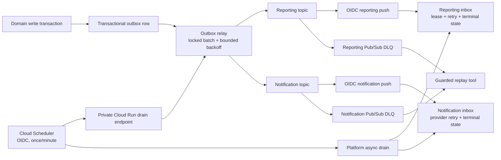

# Reliability, Scale, and Recovery Changes — 2026-08-11

## 1. Scope and evidence standard

This workstream covers only notification/event delivery, outbox reliability, scale-to-zero async
execution, load certification, database connection budgets, long-history query plans, recovery
drills, infrastructure alert coverage, and rollback evidence. It does not claim that an unexecuted
dev or production operation passed.

Evidence was taken from:

- the repository at the active scale-readiness branch;
- read-only `gcloud` and Cloud Monitoring API inspection of project `custoking` on 2026-08-11;
- focused Java/Testcontainers tests and local Terraform/PowerShell validation;
- current primary Google Cloud documentation.

The workstream performed bounded **dev-only** live mutations after explicit authorization: dev Cloud
SQL start/resize/restart, synthetic fixture writes, Pub/Sub/Scheduler certification, one disposable
history clone, and one disposable PITR clone/export. Every temporary clone/object/IAM grant created by
the completed drills was removed and independently rechecked. Production was never invoked. Scripts
continue to default to dry-run and retain explicit apply/production/disruption/cost gates.

## 2. Executive result

The repository implementation and most live dev functional/recovery gates are complete, but the two
authoritative 300-VU capacity gates **failed**. The four-hour write soak stopped at 2h28m when the
Cloud SQL CPU guard saw three consecutive samples above 80%. The subsequent mixed school-morning
read run completed but failed latency and status gates. Diagnosis found two source-proven query
defects: an attendance daily-summary N+1 query and an outbox relay ordering alias that forced a
1.38-million-row scan/sort for every 100-row claim. Both are corrected and covered by focused tests,
but are not yet deployed. Production deployment remains blocked until the fixes are deployed in dev,
the exact synthetic backlog is removed under the documented safety preconditions, and both
authoritative profiles pass on a clean `db-custom-4-7680` rerun.

| Capability | Repository state | Live state | Gate |
| --- | --- | --- | --- |
| Notification topology | OIDC/DLQ tooling deployed in dev | Valid/idempotent and poison-to-DLQ probes passed with logging provider | Real consented MSG91 acceptance remains |
| Reporting Pub/Sub resilience | Retry/DLQ and guarded replay implemented | Valid direct-DLQ replay was processed once; inspection queues returned empty after cleanup | Operational cause review remains mandatory before replay |
| Scale-to-zero outbox/projections | Request-driven drains and four OIDC Scheduler jobs deployed | Authoritative cold-instance marker drained exactly once; jobs returned to `PAUSED` | Resume only for bounded test/approved operation |
| Outbox publisher failures | Bounded retry/backoff/terminal state and health reporting deployed | Focused tests pass; normal-path outbox-to-inbox proof passed | Live repeated publisher-failure injection remains |
| Four-hour soak | Guarded 300-VU harness and evidence capture complete | **Failed** at 2h28m on three SQL CPU samples: 82.15%, 81.37%, 82.26%; application gates were still passing | Deploy fixes, clean only exact synthetic backlog, rerun full 4h10 profile |
| Morning burst | 200-VU cost gate and 300-VU sizing gate executed | 2-vCPU failed at 300 VUs; 4-vCPU passed full profile | Preserve exact measured tier; workload distribution remains an assumption |
| Mixed school-morning reads | Six authoritative GET flows, per-VU login refresh, per-flow latency/status gates | **Failed**: 13.0426% HTTP failures, overall p95 55.015 s, p99 59.998 s | Deploy N+1/relay fixes and rerun on a clean backlog |
| Long-history plans | 7.3M-row seed and plans captured on disposable clone | `historyCertified=true`; clone deleted | Distributed all-school history/partition decision remains |
| Connection budget | Automated audit passes | Peak observed backend count was 109, below the 140 stop guard | Dev 160/200 configured ceiling; prod 80/200 |
| Controlled restart | Guarded dev drill implemented | Passed; all five services healthy by 63.52 s | Repeat after material pool/network changes |
| PITR | Fail-closed dev/prod helper with confirmed cleanup evidence | Dev restore/export passed; source backup/PITR settings restored disabled | Production drill remains protected and schema-only |
| SLO/alerts | Cloud SQL and Pub/Sub backlog alert definitions added | 99 existing policies and one enabled operator channel; new definitions not applied | Terraform plan/reconciliation/apply |

Nothing in this document authorizes production rollout. Repository completion is not operational
certification.

## 3. Verified live baseline

### 3.1 Pub/Sub

The project contains the reporting and notification dev/prod topics plus their dev dead-letter topics.
Dev has both OIDC push subscriptions, explicit 10–600 second retry, ten-attempt dead-letter policy,
and durable inspection subscriptions. Production was not changed by this workstream.

The application source topics are:

- `ims-reporting-events-v1-dev`
- `ims-reporting-events-v1-prod`
- `ims-notifications-events-v1-dev`
- `ims-notifications-events-v1-prod`

The dev reporting and notification subscriptions use dedicated identities and query-free OIDC
endpoints. Production reporting still uses its earlier posture and production notification remains
outside this dev rollout.

The codebase contains a notification receiver but the current-state event inventory did not verify a
business producer publishing notification requests. Therefore the topology decision is:

1. retain both notification topics;
2. deploy OIDC-only receiver support;
3. provision the dev subscription, dead-letter topic, and inspection subscription;
4. prove a synthetic request and a real provider request in dev;
5. keep production notification provisioning blocked until a business producer and MSG91 acceptance
   criteria are verified.

This avoids silently discarding future messages while also avoiding a false claim that the current
application already exercises the topic in normal business flows.

### 3.2 Cloud Run and async execution

All 14 dev/prod Cloud Run services have `minScale=0` and request-based CPU throttling enabled. This is
the correct low-idle-cost posture for request-serving services, but an in-container `@Scheduled`
thread cannot provide a durable wake-up guarantee when the service is at zero. Google documents that
background work needs allocated CPU/minimum instances, while Scheduler can invoke an authenticated
Cloud Run service on demand. The chosen design keeps `minScale=0` and uses OIDC Scheduler requests.

Four dev jobs now exist in `asia-south1` because Scheduler is unavailable in Delhi. Their request
targets remain in `asia-south2`. Every job is `PAUSED` outside bounded proof; the final controlled
run returned all four to `PAUSED` immediately after invocation.

### 3.3 Cloud SQL

The original dev resting state was `STOPPED`, `db-f1-micro`, activation `NEVER`, 10 GiB PD-SSD,
automated backups disabled, and PITR disabled. Certification moved it through `db-custom-2-7680` and
`db-custom-4-7680`. During the failed soak the source disk automatically grew from 10 to 15 GiB;
Cloud SQL cannot shrink that disk in place. At the final reliability handoff the intended retained
state is `db-custom-4-7680`, `RUNNABLE`, activation `ALWAYS`, 15 GiB, backup/PITR disabled so the root
workstream can deploy and rerun without another restart. Final cost cleanup must explicitly restore
the cheaper tier and stop posture; production was not changed.

Initial read-only inspection found:

| Instance | State | Tier | Availability | Activation |
| --- | --- | --- | --- | --- |
| `custoking-db-dev` | `STOPPED` | `db-f1-micro` | zonal | `NEVER` |
| `custoking-db-prod` | `RUNNABLE` | `db-g1-small` | zonal | `ALWAYS` |

Production automated backups and PITR are enabled, 14 backups and seven transaction-log days are
retained, and deletion protection is enabled. These settings establish a recovery source; only a
successful isolated restore and application validation establish measured recovery performance.

### 3.4 Monitoring

The authoritative Monitoring REST inspection returned 99 enabled alert policies, not zero. One
enabled notification channel exists: `Custoking PROD primary operator email`. Existing policies
include dev/prod Cloud Run latency, 5xx, burn-rate and max-instance coverage, async outbox and
notification-inbox policies, and production uptime. The repository additions in this workstream are
the missing Cloud SQL saturation and Pub/Sub backlog-age/count definitions. They have not been
applied and must be reconciled with Terraform state before any apply.

## 4. Implemented architecture

There are two distinct failure boundaries:

- producer-to-Pub/Sub: the database outbox retries publisher failures and records terminal rows;
- Pub/Sub-to-consumer: Pub/Sub exponential retry/DLQ handles push-ingest failures, while the durable
  reporting/notification inboxes handle projection/provider failures after acknowledgment.

Keeping the boundaries distinct prevents a provider outage from repeatedly redelivering the same
Pub/Sub request while preserving a durable operator-visible failure record.

## 5. Notification OIDC and delivery topology

### 5.1 Application boundary

`PubSubPushController` now has `notification.pubsub.require-shared-token`, defaulting to `true`.
When set to `false`, the legacy query/header token is not required because Cloud Run IAM verifies the
OIDC bearer token before the request reaches Spring. The safe default protects local, direct, and
legacy deployments that do not have that infrastructure guarantee.

Deployment values are:

| Environment | `NOTIFICATION_PUBSUB_REQUIRE_SHARED_TOKEN` |
| --- | --- |
| dev | `false` |
| stage | `true` |
| prod | `true` |

Production therefore cannot accidentally lose the legacy guard from this repository change.

### 5.2 Provisioning path

`scripts/configure-notification-pubsub-push-oidc.ps1`:

- refuses production without `-AllowProduction`;
- refuses to invent a missing producer topic;
- creates a dedicated `ims-notification-push-<env>` identity only with `-Apply`;
- grants the Pub/Sub service agent token-creation permission on that identity;
- grants only service-scoped Cloud Run Invoker on platform-service;
- creates `ims-notification-service-push-<env>` with a query-free endpoint and exact service-URL
  audience;
- sets 10–600 second retry backoff, 30-second ack deadline, seven-day retention, and no inactivity
  expiry;
- creates a terminal topic and durable pull inspection subscription;
- verifies endpoint, audience, service account, and max-delivery-attempt settings after apply.

Dev dry-run passed and correctly reported the source topic present and all notification subscription
and DLQ resources absent. The live dev apply then created the dedicated push identity, query-free
OIDC subscription, notification DLQ, durable inspection subscription, 10–600 second retry policy,
and ten-attempt dead-letter policy. Production was not changed.

### 5.3 Required dev proof after deploy

1. Confirm the platform revision has `NOTIFICATION_PUBSUB_REQUIRE_SHARED_TOKEN=false`.
2. Run the provisioning script with `-Environment dev -Apply`.
3. Publish a synthetic `notification.requested.v1` using logging provider/dry-run only.
4. Require Cloud Run HTTP `204`, a query-free request URL, one inbox row, one delivery-attempt row,
   and zero residual subscription backlog.
5. Inject a malformed request and prove forwarding to the DLQ after the approximate configured
   delivery-attempt limit.
6. Replay only after recording the root cause.
7. Perform a separate real MSG91 test with approved template/recipient/consent. A logging-provider
   pass is not provider certification.

Dev result on 2026-08-11: items 1–5 passed for the logging provider. The canonical synthetic event
`dev-notification-smoke-20260811T040001Z-rest` was published twice through the Pub/Sub REST API.
Cloud Run returned HTTP 204 twice and emitted exactly one `notification.deliver` audit record, which
proves idempotent handling. The deployed provider is `logging` and `MSG91_DRY_RUN=true`, so no external
message was sent. A deliberately malformed synthetic event returned HTTP 400 until one message was
observed on the notification dead-letter inspection subscription; that test message was acknowledged
after verification. Guarded correction/replay and a consented MSG91 delivery remain open.

## 6. Reporting Pub/Sub retry and replay

`scripts/configure-reporting-pubsub-resilience.ps1` attaches explicit 10–600 second retry and a
10-attempt dead-letter policy to the existing reporting subscription. It creates a seven-day,
non-expiring inspection subscription on the DLQ. Production requires an additional explicit gate.

`scripts/replay-pubsub-dead-letter.ps1` supports reporting and notifications. It:

- defaults to dev and requires `-AllowProduction` for production;
- leases at most 100 messages;
- never acknowledges in dry-run;
- republishes the original payload/attributes before acknowledging;
- strips Pub/Sub source-wrapper attributes;
- acknowledges only messages whose republish returned exactly one message ID.

Pulling in dry-run temporarily leases messages, so operators must still coordinate inspection. The
script intentionally does not provide an automatic replay loop: poison messages must not be cycled
without diagnosis.

Live dev proof used a unique valid canonical envelope published directly to the reporting DLQ.
Dry-run pulled one message and acknowledged none. Apply republished one payload to
`ims-reporting-events-v1-dev` and acknowledged it only after publish success. The push endpoint
returned HTTP 204 at `2026-08-11T00:43:06.760243Z`; database evidence showed one reporting inbox
row, `processed=1`, `failed=0`. This proves the replay mechanism, not automatic dead-letter routing.
A first shell-quoted probe encoded invalid JSON, was allowed to reach the DLQ, matched by its unique
marker, and was acknowledged **without replay** during cleanup. Both inspection subscriptions were
empty before testing and the reporting inspection subscription was returned empty afterward.

The reporting processor already leases rows with `FOR UPDATE SKIP LOCKED`, reclaims stale five-minute
processing leases, retries failed rows with increasing delays, and dead-letters at five processing
failures. New focused tests prove a projector exception calls `markFailed` and a reclaimed successful
event calls `markProcessed`.

## 7. Scale-to-zero outbox and inbox execution

### 7.1 Problem

School-core, operations, billing, reporting projections, and notification retries used only
in-container schedules. At `minScale=0`, a failed publish/projection could remain pending indefinitely
after the final request completed. Keeping four instances warm would add continuous idle cost and
still would not be a durable scheduler guarantee.

### 7.2 Request-driven drains

New private routes are:

| Service | Method/path | Work |
| --- | --- | --- |
| school-core | `POST /api/v1/internal/outbox/relay` | tenant-school outbox batch |
| operations | `POST /api/v1/internal/outbox/relay` | firefighting outbox batch |
| billing | `POST /api/v1/internal/outbox/relay` | billing outbox batch |
| platform | `POST /api/v1/internal/async/drain` | reporting projection batch + due notification retries |

The API gateway has no route for either internal path. Cloud Run must remain private, and only the
dedicated Scheduler identity should receive service-scoped Invoker on these services.

### 7.3 Scheduler provisioning

`scripts/configure-async-relay-scheduler.ps1` defines four once-per-minute jobs. It defaults to
dry-run, refuses production without `-AllowProduction`, and refuses to enable the currently disabled
API unless `-Apply -EnableCloudSchedulerApi` are both supplied. Each job uses:

- dedicated `ims-async-scheduler-<env>` identity;
- exact Cloud Run service URL as OIDC audience;
- POST to the private drain path;
- 300-second attempt deadline;
- three Scheduler retries with 10–300 second backoff.

Cloud Scheduler does not offer `asia-south2`. The job control-plane location is therefore the
supported `asia-south1` location, while all HTTP targets, databases and runtime data remain in
`asia-south2`. `-SchedulerLocation` is explicit and the apply path verifies it against the live
Scheduler locations list before creating a job.

Official pricing at the evidence date is US$0.10/job/month with three free jobs per billing account.
Four jobs therefore add at most one billable job (US$0.10/month) if the account-level free tier is
otherwise unused. Invocation/Cloud Run/SQL usage remains usage-billed. This is materially cheaper
than four always-warm instances.

The authoritative proof used marker `scheduler-zero-drain-20260811t0028z`. Cloud Monitoring first
reported `active=0` and `idle=0` for all four services. A database-only seed then showed one pending
row per domain with `published=0`, `attempts=0`, and no inbox rows. Each job was resumed, manually
invoked once, and paused in a `finally` block. Request evidence was:

| Target | Result | Latency |
| --- | --- | ---: |
| School outbox relay | HTTP 200 at `00:31:07.705997Z`; cold instance log present | 20.203 s |
| Operations outbox relay | HTTP 200 at `00:31:20.011838Z` | 10.170 s |
| Billing outbox relay | HTTP 200 at `00:31:31.315129Z` | 10.449 s |
| Platform async drain | HTTP 200 at `00:31:42.634875Z` | 0.042 s |

Terminal state was exact: every outbox row had `published=1`, `attempts=1`, `deadLettered=0`; the
reporting inbox had three rows, all `PROCESSED`, zero failed. The earlier diagnostic marker is not
Scheduler proof because in-process schedules drained it before every service reached zero.

### 7.4 Outbox correctness hardening

The previous scheduled method called a transactional batch method from the same object. That path
could bypass proxy transaction interception. Each scheduled entry point is now itself transactional;
the request controller also enters through the proxied batch method. `FOR UPDATE SKIP LOCKED` now
runs inside a real transaction in both paths.

Three additive migrations add:

- `last_error`;
- `next_attempt_at`;
- `dead_lettered_at`;
- query-aligned ready, pending-age, and dead-letter partial indexes.

For each publisher failure, the relay now persists an attempt, truncated error, exponential delay
(10 seconds capped at one hour), and terminal state at the configurable default of ten attempts.
One failed row does not roll back successful rows from the same batch. Successful publication clears
retry state and marks the event only after the publisher returns, preserving at-least-once behavior.

Structured outbox health reporters now emit the exact fields expected by existing log metrics:

- `health.outbox.pendingCount`
- `health.outbox.deadLetterCount`
- `health.outbox.oldestPendingAgeSeconds`

This fixes the prior mismatch where Terraform expected those log fields but domain services did not
emit them. Health collection does not scan published history, but its exact pending count must still
walk the partial pending index. The failed soak demonstrated that this is material when a synthetic
test creates more than one million pending rows; the clean rerun must determine whether it remains
material after the relay claim fix. Relay indexes match the intended ordering (`id` for
school/operations and `created_at,id` for billing), while a separate `occurred_at` partial index
supports oldest-pending lookup.

The additive Flyway migrations create indexes with ordinary `CREATE INDEX`. PostgreSQL permits reads
but blocks concurrent writes while each index is built. Existing unpublished indexes are retained
(not dropped), so rollback does not lose the old access path. Before production, record outbox table
sizes and run `EXPLAIN`; if build duration is material, move index creation into an approved
non-transactional `CREATE INDEX CONCURRENTLY` migration/maintenance step instead of deploying during
a school write peak.

Rollback compatibility is favorable: the migrations are additive, older code ignores the columns,
and the old unpublished-row query still finds retry/dead-letter rows. During rollback, pause Scheduler
jobs and change push subscriptions to pull before reverting traffic if duplicate side effects are a
concern. Do not delete inbox/outbox/DLQ rows.

### 7.5 Load-discovered backlog and relay correction

The write soak repeatedly updated each synthetic section throughout the four-hour profile. This is a
deliberate sustained-write stress model, not a realistic claim that each section is registered again
every few seconds in a normal school day. It appended 1,604,148
`attendance-daily.upserted.v1` events. At `2026-08-11T05:34Z`, the tenant-school outbox contained
1,604,452 total rows: 190,779 published, 1,413,673 pending, zero dead-lettered. Every pending row was
an attendance event for one of the 100 verified `SCALE-%` schools. The relay advanced only 9,700 rows
in 25 minutes (6.47/s), which would have required approximately 60.7 hours to drain that snapshot.

The deployed claim selected `id::text AS id` and then used unqualified `ORDER BY id`. PostgreSQL
resolved the order expression to the text projection alias, not the numeric table column. Live
`EXPLAIN` therefore showed a sequential scan and sort over approximately 1.38 million eligible rows
before `LIMIT 100`, with estimated startup cost 214,629.32. The correction aliases the table and uses
`ORDER BY o.id`. Against the same live backlog, the planner selected `idx_ts_outbox_ready`, startup
cost 0.43 and `Limit` total cost 16.68. The identical numeric-ID defect was corrected in the
operations relay. Billing orders by `created_at` and did not have this alias collision. Evidence is
`artifacts/load-certification/outbox-relay-qualified-plan-202608110550.json`.

The cleanup action is intentionally narrower than fleet cleanup. `ScaleBacklogCleanup` verifies the
expected count of `SCALE-%` schools, rejects any non-scale school in the reserved range, captures
inside/outside counts, and deletes only scale-scoped rows from
`tenant_school.outbox_events` and `reporting.reporting_event_inbox`. It never deletes schools,
students, attendance source rows, or reporting facts. Disposable PostgreSQL 16 validation proved
both the successful scoped delete and transactional rollback when a non-scale reserved ID exists.
It must not run until all four Scheduler jobs are paused, reporting Pub/Sub undelivered messages are
zero, relevant Cloud Run services are idle, the source changes are reviewed, and the root operator
approves the exact execution.

## 8. Connection budget

`scripts/audit-db-connection-budget.ps1` derives each database service's Cloud Run max instances and
Hikari maximum, reserves 40 of 200 connections for migrations, jobs, operators, and recovery, and
fails when the fleet ceiling exceeds 160.

Current calculated ceilings:

| Environment | Identity | School-core | Operations | Platform | Billing | Total | Result |
| --- | ---: | ---: | ---: | ---: | ---: | ---: | --- |
| dev | 20 | 80 | 20 | 20 | 20 | 160/200 | Pass at exact application ceiling |
| prod | 10 | 40 | 10 | 10 | 10 | 80/200 | Pass with 120 theoretical spare |

The dev value is a configuration ceiling, not observed concurrent use. It leaves exactly the 40
reserved connections; increasing any dev max instance or pool without changing another value must
fail review. The full 300-VU/4-vCPU burst observed 99 backends, below the 140 stop guard. The
2-vCPU rejection observed 94; connections were not the limiting resource.

## 9. Load certification harness

`scripts/invoke-dev-load-certification.ps1` has three profiles:

| Profile | VUs | Ramp | Hold | Purpose |
| --- | ---: | --- | --- | --- |
| `Soak` | 300 | 5m up/down | 4h | sustained approved ceiling |
| `MorningBurst` | 300 | 30s up, 2m down | 15m | synchronized morning arrival |
| `MixedMorning` | 300 | 1m up/down | 15m | distributed read-heavy school morning |

Safety controls:

- dev/localhost URLs only;
- explicit `-AllowScaleWrites`;
- fixed short-lived tokens or per-VU synthetic login credentials, never written to evidence; each VU
  refreshes login before the 15-minute application-token expiry during a long soak;
- refuses values above the currently approved 300-VU boundary;
- requires dev SQL `RUNNABLE`;
- polls authoritative Cloud Monitoring CPU, PostgreSQL backends, and
  `database/memory/components{component="Usage"}` every minute;
- stops after three **distinct metric timestamps** at/above CPU 80%, Usage memory 90%, or 140
  backends;
- refreshes Monitoring credentials and retries one 401 once; three consecutive collection failures
  still fail closed;
- retains a Windows process handle, records a numeric k6 exit code, and fails closed if unavailable;
- retains k6 summary/stdout/stderr and a secret-free guardrail evidence JSON.

Measured results:

| Shape/profile | Result | CPU | Usage memory | Backends | HTTP/errors | Attendance write p95/p99 |
| --- | --- | ---: | ---: | ---: | --- | ---: |
| `db-custom-2-7680`, 300 VU | **Stopped/fail** after three CPU breaches | 83.52% | 48.638% | 94 | 120,816 / 0 before stop | 445.45 / 840.14 ms |
| `db-custom-2-7680`, 200 VU | App thresholds pass; exit-code capture limitation | 58.0% | 48.087% | 92 | 185,060 / 2 EOF | 126.73 / 186.29 ms (p99 from stdout) |
| `db-custom-4-7680`, 300 VU first attempt | Inconclusive; stopped on Monitoring 401 | 48.62% | 46.917% | 85 | partial only | not a capacity pass |
| `db-custom-4-7680`, 300 VU full rerun | **Pass**, k6 exit 0 | 58.29% | 48.423% | 99 | 276,923 / 38 (0.013722%, all 429, no 5xx) | 115.817 / 262.703 ms |
| `db-custom-4-7680`, 300 VU 4h soak | **Stopped/fail** at 2h28m on three CPU breaches | 82.26% | 48.089% | 94 | 2,405,050 / 121 (0.005031%, all 429, no 5xx) | 350.45 / 626.16 ms |

VU-to-population mapping is a planning assumption, not evidence of real school-day concurrency.
Production sizing must use observed per-school arrival curves. Delhi list prices captured on the
evidence date were US$0.0496/vCPU-hour and US$0.0084/GiB-hour: 2 vCPU/7.5 GiB is approximately
US$0.1622/hour, while 4 vCPU/7.5 GiB is US$0.2614/hour (US$190.82 at 730 hours), before
storage/network/backup. Four vCPU passed the short burst but failed the pre-fix sustained CPU gate;
it is not yet a certified production shape. The next supported custom-core step, 6 vCPU/7.5 GiB, is
approximately US$0.3606/hour (US$263.24 at 730 hours), an additional US$72.42/month. Cost discipline
requires rerunning the source fixes on 4 vCPU first; scale to 6 vCPU only if the clean, fixed run still
proves a CPU bottleneck.

The mixed profile uses the deployed GET contracts for student pagination, command-center,
daily attendance summary, fee structure, fee defaulters, and attendance summary reporting. Three of
300 VUs map to each reserved school; each VU rotates one flow per iteration, logs in independently,
and refreshes before token expiry. Each flow must satisfy p95 below 800 ms and p99 below 2,000 ms,
must produce 2xx samples, and has explicit zero-4xx/zero-5xx counters. A live one-user preflight
proved all six routes return HTTP 200. Its two cold student-list samples had p95 1.18 s, so that
14-second smoke was intentionally not called a latency pass and the master read gate was not
weakened. The full 15-minute run failed: 34,395 requests included 4,486 failures (13.0426%), with
794 HTTP 4xx and 2,433 HTTP 5xx plus client/network timeouts. Overall p95/p99 were
55.015/59.998 seconds. Student list, daily attendance, fee structure and attendance report all had
p95 above 52 seconds; dashboard and fee-defaulter p95 passed but their p99 exceeded six seconds.
Cloud Run logs tied the 5xx responses to the four failing data-heavy flows. Source review then found
`dailySummary` executing one student-count query per section (250 extra queries for the 10,000-student
school). It now obtains school-scoped enrollment counts in one grouped join; a focused PostgreSQL 16
round-trip suite passes 8/8, including an empty-section boundary case. This fix is not certified until
deployed and the same 300-VU profile passes.

## 10. Long-history query plans

The scale-fixture tool now supports `LongHistorySeed` and `QueryPlans`. Plan capture executes only
SELECT statements against application tables with a 60-second timeout; its transaction is
technically read-write solely because PostgreSQL requires that mode for session-local temporary
result tables. It captures JSON `EXPLAIN (ANALYZE, BUFFERS, WAL)` for:

- school-scoped student directory pagination;
- school-scoped student search;
- two-year attendance history;
- two-year reporting attendance aggregation.

It refuses to run without the full 300,000-student fixture. It records row counts and sets
`historyCertified=true` only when the 10,000-student school has at least 7,300,000 attendance rows
spanning at least 700 days. Anything smaller is diagnostic only. This prevents a fast plan over an
empty/single-day table from being reported as multi-year certification.

Required acceptance evidence per plan:

- actual total time and rows;
- shared read/hit blocks and temp I/O;
- scan/index types;
- rows removed by filters;
- sort method/memory;
- p95/p99 API latency from the matching workload.

The history seed ran on disposable clone `custoking-dev-history-cert-08110056`, never on the source.
It created exactly 7,300,000 detailed attendance rows over 730 days for school `900000000`, plus
182,500 daily and 182,500 reporting fact rows. Database size was 5,442,034,711 bytes. Total fixture
attendance was 7,590,000 because other synthetic schools already had current-day attendance. The
clone auto-grew from 10 to 15 GiB and was deleted at `2026-08-11T01:27:20Z`; the source remained
10 GiB.

`historyCertified=true`. Exact plans:

- attendance detail used `idx_attendance_student_records_school_date`, returned 500 rows, and
  completed in 0.272 ms;
- the reporting aggregate chose a parallel sequential scan over approximately 190,553 synthetic fact
  rows and completed in 71.244 ms; the existing school/date index was not selected;
- student page used `students_pkey` and completed in 4.163 ms;
- student search used the school-id index then filtered 10,000 school rows in 21.728 ms.

Do not claim every plan avoids sequential scans. A new index is not justified solely by the 71 ms
synthetic plan. Production-like multi-school distribution, growth, partitioning, and matching API
latency under concurrent historical reporting remain gates.

## 11. Recovery drills

### 11.1 Controlled restart

`scripts/invoke-cloudsql-restart-drill.ps1` is dev-only. It requires both `-Apply` and
`-AllowDevDisruption`, refuses a non-runnable instance, records current Ready revisions, restarts the
instance, then invokes each private database service health endpoint with an audience-bound identity
token until all five recover. Evidence contains SQL command time and per-service/application RTO.

The script does not call a write API after recovery. The authenticated 40-case smoke should still be
run separately to prove transactional writes and tenant isolation.

Live dev result: **passed**. The restart command completed in 19.71 seconds. Authenticated health
returned HTTP 200 for school-core at 44.18 s, operations at 46.49 s, platform at 48.73 s, billing at
51.23 s, and identity at 63.48 s; all five were recovered by 63.52 s. Evidence:
`artifacts/recovery/cloudsql-restart-dev-20260811004522.json`.

### 11.2 PITR

The restore helper defaults to dev. Production requires all of: `Environment=prod`, the exact source
`custoking-db-prod`, and `-AllowProductionRecoveryDrill`; production validation uses Cloud SQL Admin
REST with `sqlExportOptions.schemaOnly=true` so the drill never copies production rows/PII into the
bucket. Dev apply requires `-AllowDevRecoveryCost`. The helper checks region/state and database
presence, verifies a non-empty export, and confirms removal of the object, temporary bucket IAM, and
clone before evidence can become `PASSED`. It does **not** validate row counts or checksums.

Evidence records:

- recovery-point age seconds;
- clone-ready seconds;
- validation RTO seconds.

The dev drill temporarily enabled automated backup/PITR, verified on-demand backup
`1786414443751`, and queried the official recovery window: earliest
`2026-08-11T02:13:29.515Z`, latest `02:14:38.758307933Z`. Restore point `02:14:20Z` was inside the
window. The clone became RUNNABLE in 539.49 s; a 65,248,345-byte full **synthetic** export completed
validation at 582.57 s. `dataRowsValidated=false`. Final evidence was written only after clone,
object, and temporary IAM absence were independently confirmed; all cleanup flags are true. The two
certification-created backups were deleted and the source returned to backup disabled/PITR false,
10 GiB. Evidence: `artifacts/recovery/custoking-dev-restore-drill-20260811021651.json`.

This validates source readability and cleanup, not application semantic correctness. A future
approved drill should add non-PII invariant hashes/counts and a temporary application connection.

## 12. Alert coverage added

Terraform now defines:

- Cloud SQL CPU >80% for five minutes;
- Cloud SQL `Usage` memory component >90% for ten minutes;
- PostgreSQL connections >140 for five minutes;
- reporting and notification subscription backlog >100 for five minutes;
- oldest unacknowledged message >300 seconds for five minutes.

These use official GA metrics:

- `cloudsql.googleapis.com/database/cpu/utilization`
- `cloudsql.googleapis.com/database/memory/components` filtered to `component="Usage"`
- `cloudsql.googleapis.com/database/postgresql/num_backends`
- `pubsub.googleapis.com/subscription/num_undelivered_messages`
- `pubsub.googleapis.com/subscription/oldest_unacked_message_age`

Terraform formatting and validation pass. Before apply, run plans against the existing dev/prod
state and confirm there is no destructive drift and the effective production notification channel
is attached. Notification-subscription alerts may be created before the subscription; they will have
no series until provisioning.

Dev apply result on 2026-08-11: the first full plan was rejected because it proposed deleting five
pre-existing uptime-check invoker bindings. No destructive plan was applied. A targeted additive plan
was then machine-checked as `9 add, 0 change, 0 destroy` and applied: one log metric plus eight enabled
alert policies. Subsequent operational alert additions bring live enumeration to 110 policies; the
expected SQL/Pub/Sub/notification
policies exist and each references the existing operator notification channel. A synthetic alert
delivery/clear test is still required before OBS-01 can close.

## 13. Rollout and rollback order

### Dev rollout

1. Review additive migrations and capture current image digests/revisions.
2. Deploy the four Java services; do not create Scheduler jobs first.
3. Verify migrations, readiness, authenticated gateway smoke, and internal routes absent from gateway.
4. Provision notification OIDC/DLQ and reporting retry/DLQ.
5. Publish synthetic valid and poison probes; verify inbox, ack, DLQ, and replay behavior.
6. Enable Scheduler API explicitly and create the four dev jobs.
7. Create an outbox row, allow all services to scale to zero, and prove publication/projection within
   two Scheduler intervals.
8. Inject publisher failure until retry/dead-letter state and health alerts are visible, then repair
   and replay under operator control.
9. Terraform-plan/apply infrastructure alerts and test notification routing.
10. Execute morning burst, four-hour soak, query plans, restart, and isolated recovery drill.

### Rollback

1. Pause Scheduler jobs; paused jobs still count for Scheduler billing.
2. Clear push config to convert affected subscriptions to pull and retain backlog.
3. Restore prior Cloud Run traffic/digests.
4. Keep additive columns and all inbox/outbox/DLQ rows.
5. Re-enable legacy shared-token requirements where the prior endpoint requires them.
6. Resume only after verifying no duplicate provider side effects.
7. Record exact revision, digest, traffic, database version, backlog counts, and operator/timestamps.

Rollback is not certified until a dev drill proves these steps. Existing rollback workflow/evidence
assets remain the control plane; this workstream did not execute a traffic rollback.

## 14. Validation evidence from this change

### Java

Focused tests passed:

| Service | Tests | Failures/errors/skips |
| --- | ---: | ---: |
| school-core | 5 | 0/0/0 |
| operations | 5 | 0/0/0 |
| billing | 4 | 0/0/0 |
| platform | 18 | 0/0/0 |
| Total | 32 | 0/0/0 |

The initial billing run and subsequent focused retry runs together also compiled/migrated all three
new outbox migrations on PostgreSQL 16 through Testcontainers. A reporter integration case in each
domain service executed the scalar health query against its migrated schema and asserted pending,
dead-letter, and oldest-age values. The focused evidence table aggregates the latest selected suites;
no claim is made that every service suite was rerun.

The later integrated repository validation reported 1,016 regular Java tests with zero failures and
four fresh opt-in integration tests with zero failures. Frontend validation reported 146 passing tests,
both builds passing, React Router 7.18.2, and zero npm-audit findings. Those wider counts belong to the
coordinated root validation; the 32-case table above is this workstream's focused subset.

Post-load diagnosis added three PostgreSQL 16 focused results: attendance daily-summary round-trip
8/8, school-core outbox relay 5/5, and operations outbox relay 5/5. The two relay suites include a
numeric-ID ordering regression (`2` must be claimed before `10`) that fails if `ORDER BY` resolves to
the projected text alias.

### Scripts and infrastructure

- Changed/new reliability PowerShell files parsed with zero syntax errors; the pinned k6 script
  inspection also completed after providing its required safe environment variables.
- Exact backlog cleanup passed a disposable PostgreSQL 16 scope test and its non-scale reserved-ID
  rejection test; the rejected transaction preserved both scale and non-scale rows.
- Notification and reporting topology are deployed in dev with exact OIDC/retry/DLQ settings;
  production was not mutated.
- Four exact Scheduler jobs are deployed and returned to `PAUSED` after the cold-instance proof.
- Connection audit: dev `160/200` and prod `80/200`, both pass a 40-connection reserve.
- Terraform `fmt -check` and `validate`: pass.
- `git diff --check`: pass at validation time.

## 15. Live dev execution evidence

- Commit `4d0a56bf6f753a9012e3ead5af761ee6b58d7914` passed CodeQL run
  `31435682010` for Java and JavaScript/TypeScript.
- Dev deployment run `31435682086` completed successfully. Release
  `rel-dev-4d0a56bf6f75-1` built and deployed seven immutable images through seven serial successful
  Cloud Deploy rollouts; live inspection found all seven latest Ready revisions receiving 100% traffic.
- The workflow gateway-health smoke passed. Cloud Run Job execution
  `ims-direct-service-smoke-x6p8j` subsequently completed with one successful task and no failed task.
- The guarded authenticated regression then provisioned temporary dev smoke identities/data, passed
  40/40 gateway checks with zero failures, ran the photo-upload path, and retired its temporary users
  and student in `finally`. The independent real-environment preflight returned `Ready=true` with
  zero blockers; the missing legacy-compatibility artifact was an expected warning for env-suffixed CD.
- Notification OIDC/DLQ and reporting retry/DLQ applies completed. Both endpoints are query-free,
  audience-bound, use dedicated service accounts, and have 10–600 second retry plus ten-attempt DLQ
  policies.
- Cloud Scheduler is unsupported in Delhi (`asia-south2`), so only the Scheduler control plane is in
  Mumbai (`asia-south1`). Four jobs exist and are `PAUSED`. The authoritative cold-instance marker
  proved all three producer events published once and all three reporting inbox rows processed.
- Reporting DLQ replay proved dry-run/no-ack and apply/republish-before-ack. The valid event processed
  once; the invalid diagnostic was acknowledged without replay after exact-marker verification.
- The 300,000-student fixture contains 100 schools, a 10,000-student largest school, and 7,576
  sections. Initial seed completed in 76.52 seconds. The 7.3M/two-year extension was isolated on a
  clone to avoid permanent source storage growth; that clone was deleted. The later write soak,
  independently, caused the source disk to auto-grow to 15 GiB.
- Controlled SQL restart passed with 63.52-second application RTO. The PITR clone became RUNNABLE in
  539.49 seconds and validation completed in 582.57 seconds; final cleanup was confirmed.
- The 2-vCPU/7.5-GiB shape failed the 300-VU CPU guard. Four vCPU/7.5 GiB passed the full short burst,
  but the four-hour soak failed the sustained CPU guard after 2h28m and the subsequent mixed profile
  failed latency/status gates. Exact evidence files are
  `artifacts/load-certification/soak-20260811023532-evidence.json` and
  `artifacts/load-certification/mixedmorning-20260811051124-evidence.json`.
- Automated backup/PITR were returned to the original disabled state. Both certification-created
  backups, the PITR clone, validation object, temporary IAM, history clone, and malformed DLQ probe
  are absent. The 300,000-student fixture and `db-custom-4-7680` `RUNNABLE/ALWAYS` state are
  intentionally preserved for root's deployed fix verification and authoritative reruns. The exact
  synthetic outbox/inbox backlog and async/DLQ markers remain pending the guarded cleanup sequence;
  no fleet/student cleanup has run. Root owns that execution, final fleet cleanup, resize to
  `db-f1-micro`, and return to activation `NEVER`/`STOPPED`.
- Terraform was explicitly reinitialized from an accidentally selected production backend to the
  dev state before planning. The destructive full plan was rejected; only the verified additive
  nine-resource dev plan was applied.

## 16. Gates that remain open

1. Deploy the attendance daily-summary N+1 fix and numeric outbox-order fixes to dev; prove the live
   school-core relay plan remains an index scan.
2. With all Scheduler jobs paused, reporting Pub/Sub backlog at zero and relevant services idle,
   execute the reviewed exact scale-backlog and marker cleanup. Preserve all 100 schools, 300,000
   students, attendance source rows and reporting facts for the rerun.
3. Rerun the full 4h10 300-VU soak and then the exact 300-VU mixed profile on clean
   `db-custom-4-7680`. Both k6 thresholds and infrastructure guards must pass. If fixed 4 vCPU still
   breaches CPU, test the least-next 6-vCPU shape rather than pre-allocating it continuously.
4. Trigger and clear a synthetic alert through the operator channel; add/test the still-missing
   relay-job, trace-export, storage-growth, and cost-forecast alert coverage.
5. Prove a dev traffic rollback and retained backlog in the separate release-control workstream.
6. Run a production-like all-school/multi-year reporting distribution test before selecting a new
   index or partitioning scheme; the 71.244 ms synthetic parallel sequential scan is not enough.
7. Replace planning VU-to-student mapping with observed school-day arrival/concurrency data.
8. Provision/migrate production only after every dev gate passes; production reporting still has the
   legacy query-credential posture and production runtime IAM remains a separate rollout concern.

## 17. Primary sources

- [Authenticate Pub/Sub push subscriptions](https://docs.cloud.google.com/pubsub/docs/authenticate-push-subscriptions)
- [Pub/Sub push behavior and acknowledgments](https://docs.cloud.google.com/pubsub/docs/push)
- [Pub/Sub dead-letter topics and required IAM](https://docs.cloud.google.com/pubsub/docs/dead-letter-topics)
- [Pub/Sub subscription retry policy](https://docs.cloud.google.com/pubsub/docs/subscription-retry-policy)
- [Monitor Pub/Sub subscriptions](https://docs.cloud.google.com/pubsub/docs/monitoring)
- [Run Cloud Run services on a schedule](https://docs.cloud.google.com/run/docs/triggering/using-scheduler)
- [Cloud Scheduler HTTP target authentication](https://docs.cloud.google.com/scheduler/docs/http-target-auth)
- [Cloud Scheduler pricing](https://cloud.google.com/scheduler/pricing)
- [Cloud Run autoscaling and background work](https://docs.cloud.google.com/run/docs/about-instance-autoscaling)
- [Cloud Run billing/CPU settings](https://docs.cloud.google.com/run/docs/configuring/billing-settings)
- [Cloud SQL PostgreSQL PITR](https://docs.cloud.google.com/sql/docs/postgres/backup-recovery/pitr)
- [Cloud SQL restart command](https://docs.cloud.google.com/sdk/gcloud/reference/sql/instances/restart)
- [Official Cloud SQL and Pub/Sub metric descriptors](https://docs.cloud.google.com/monitoring/api/metrics_gcp_c)
