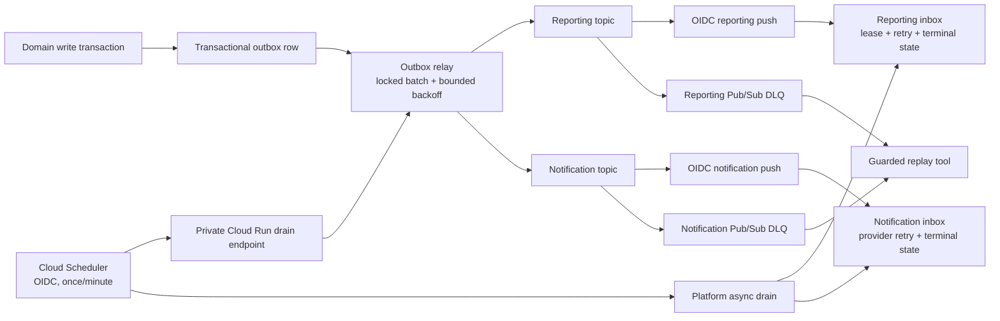

# Reliability, Scale, and Recovery Changes — 2026-08-11

## 1. Scope and evidence standard

This workstream covers only notification/event delivery, outbox reliability, scale-to-zero async
execution, load certification, database connection budgets, long-history query plans, recovery
drills, infrastructure alert coverage, and rollback evidence. It does not claim that an unexecuted
dev or production operation passed.

Evidence was taken from:

- the repository at the active scale-readiness branch;
- read-only `gcloud` and Cloud Monitoring API inspection of project `custoking` on 2026-08-11;
- focused Java/Testcontainers tests and local Terraform/PowerShell validation;
- current primary Google Cloud documentation.

No GCP resource was created, updated, deleted, deployed, restarted, or restored in this workstream.
All scripts that can mutate GCP default to dry-run and use explicit apply/production/disruption gates.

## 2. Executive result

The repository now contains the missing implementation paths, but the live certification remains
deliberately incomplete.

| Capability | Repository state | Live state | Gate |
| --- | --- | --- | --- |
| Notification push consumer | OIDC-only mode implemented and tested | No notification subscription | Deploy platform revision, then provision dev |
| Notification topology | Dry-run-first OIDC/DLQ provisioning script | Topics exist; subscriptions absent | Dev change approval |
| Reporting Pub/Sub resilience | Retry/DLQ provisioning and replay tooling | OIDC dev push exists; no DLQ/retry policy | Dev change approval |
| Scale-to-zero outbox/projections | Request-driven drain endpoints plus Scheduler provisioning | Scheduler API disabled; zero Scheduler jobs | Enable API and create four dev jobs |
| Outbox publisher failures | Bounded retry, backoff, terminal state, structured health | New migrations/code not deployed | Dev deploy and failure injection |
| Four-hour soak | Guarded 300-VU harness implemented | Not executed | Four-hour dev window and short-lived tokens |
| Morning burst | Guarded 300-VU burst profile implemented | Not executed | Approved dev window |
| Long-history plans | Read-only capture and evidence threshold implemented | Not executed; dev SQL stopped | 7.3M-row/two-year fixture required |
| Connection budget | Automated audit passes | Live peaks still require soak evidence | Dev 160/200 configured ceiling; prod 80/200 |
| Controlled restart | Guarded dev drill and RTO evidence implemented | Not executed | Disruption approval |
| PITR | Existing isolated-clone drill enhanced with measured RPO/RTO fields | Production policy enabled; drill not executed here | Recovery operator, time, and temporary-instance cost |
| SLO/alerts | Cloud SQL and Pub/Sub backlog alert definitions added | 99 existing policies and one enabled operator channel; new definitions not applied | Terraform plan/reconciliation/apply |

Nothing in this document authorizes production rollout. Repository completion is not operational
certification.

## 3. Verified live baseline

### 3.1 Pub/Sub

The project contains exactly these four application topics:

- `ims-reporting-events-v1-dev`
- `ims-reporting-events-v1-prod`
- `ims-notifications-events-v1-dev`
- `ims-notifications-events-v1-prod`

Only two subscriptions exist:

- `ims-reporting-service-push-dev`
- `ims-reporting-service-push-prod`

There is no dev or production notification subscription. The dev reporting subscription uses the
dedicated reporting push service account and a query-free OIDC endpoint. Production still uses the
legacy identity/query-credential posture and must be migrated separately. Neither reporting
subscription had an attached dead-letter policy or explicit exponential retry policy at inspection
time.

The codebase contains a notification receiver but the current-state event inventory did not verify a
business producer publishing notification requests. Therefore the topology decision is:

1. retain both notification topics;
2. deploy OIDC-only receiver support;
3. provision the dev subscription, dead-letter topic, and inspection subscription;
4. prove a synthetic request and a real provider request in dev;
5. keep production notification provisioning blocked until a business producer and MSG91 acceptance
   criteria are verified.

This avoids silently discarding future messages while also avoiding a false claim that the current
application already exercises the topic in normal business flows.

### 3.2 Cloud Run and async execution

All 14 dev/prod Cloud Run services had `minScale=0` and request-based CPU throttling enabled. This is
the correct low-idle-cost posture for request-serving services, but an in-container `@Scheduled`
thread cannot provide a durable wake-up guarantee when the service is at zero. Google documents that
background work needs allocated CPU/minimum instances, while Scheduler can invoke an authenticated
Cloud Run service on demand. The chosen design keeps `minScale=0` and uses OIDC Scheduler requests.

Cloud Scheduler API was disabled and no Scheduler jobs existed. No API was enabled during this work.

### 3.3 Cloud SQL

Read-only inspection found:

| Instance | State | Tier | Availability | Activation |
| --- | --- | --- | --- | --- |
| `custoking-db-dev` | `STOPPED` | `db-f1-micro` | zonal | `NEVER` |
| `custoking-db-prod` | `RUNNABLE` | `db-g1-small` | zonal | `ALWAYS` |

Production automated backups and PITR are enabled, 14 backups and seven transaction-log days are
retained, and deletion protection is enabled. These settings establish a recovery source; only a
successful isolated restore and application validation establish measured recovery performance.

### 3.4 Monitoring

The authoritative Monitoring REST inspection returned 99 enabled alert policies, not zero. One
enabled notification channel exists: `Custoking PROD primary operator email`. Existing policies
include dev/prod Cloud Run latency, 5xx, burn-rate and max-instance coverage, async outbox and
notification-inbox policies, and production uptime. The repository additions in this workstream are
the missing Cloud SQL saturation and Pub/Sub backlog-age/count definitions. They have not been
applied and must be reconciled with Terraform state before any apply.

## 4. Implemented architecture

There are two distinct failure boundaries:

- producer-to-Pub/Sub: the database outbox retries publisher failures and records terminal rows;
- Pub/Sub-to-consumer: Pub/Sub exponential retry/DLQ handles push-ingest failures, while the durable
  reporting/notification inboxes handle projection/provider failures after acknowledgment.

Keeping the boundaries distinct prevents a provider outage from repeatedly redelivering the same
Pub/Sub request while preserving a durable operator-visible failure record.

## 5. Notification OIDC and delivery topology

### 5.1 Application boundary

`PubSubPushController` now has `notification.pubsub.require-shared-token`, defaulting to `true`.
When set to `false`, the legacy query/header token is not required because Cloud Run IAM verifies the
OIDC bearer token before the request reaches Spring. The safe default protects local, direct, and
legacy deployments that do not have that infrastructure guarantee.

Deployment values are:

| Environment | `NOTIFICATION_PUBSUB_REQUIRE_SHARED_TOKEN` |
| --- | --- |
| dev | `false` |
| stage | `true` |
| prod | `true` |

Production therefore cannot accidentally lose the legacy guard from this repository change.

### 5.2 Provisioning path

`scripts/configure-notification-pubsub-push-oidc.ps1`:

- refuses production without `-AllowProduction`;
- refuses to invent a missing producer topic;
- creates a dedicated `ims-notification-push-<env>` identity only with `-Apply`;
- grants the Pub/Sub service agent token-creation permission on that identity;
- grants only service-scoped Cloud Run Invoker on platform-service;
- creates `ims-notification-service-push-<env>` with a query-free endpoint and exact service-URL
  audience;
- sets 10–600 second retry backoff, 30-second ack deadline, seven-day retention, and no inactivity
  expiry;
- creates a terminal topic and durable pull inspection subscription;
- verifies endpoint, audience, service account, and max-delivery-attempt settings after apply.

Dev dry-run passed and correctly reported the source topic present and all notification subscription
and DLQ resources absent. The live dev apply then created the dedicated push identity, query-free
OIDC subscription, notification DLQ, durable inspection subscription, 10–600 second retry policy,
and ten-attempt dead-letter policy. Production was not changed.

### 5.3 Required dev proof after deploy

1. Confirm the platform revision has `NOTIFICATION_PUBSUB_REQUIRE_SHARED_TOKEN=false`.
2. Run the provisioning script with `-Environment dev -Apply`.
3. Publish a synthetic `notification.requested.v1` using logging provider/dry-run only.
4. Require Cloud Run HTTP `204`, a query-free request URL, one inbox row, one delivery-attempt row,
   and zero residual subscription backlog.
5. Inject a malformed request and prove forwarding to the DLQ after the approximate configured
   delivery-attempt limit.
6. Replay only after recording the root cause.
7. Perform a separate real MSG91 test with approved template/recipient/consent. A logging-provider
   pass is not provider certification.

Dev result on 2026-08-11: items 1–5 passed for the logging provider. The canonical synthetic event
`dev-notification-smoke-20260811T040001Z-rest` was published twice through the Pub/Sub REST API.
Cloud Run returned HTTP 204 twice and emitted exactly one `notification.deliver` audit record, which
proves idempotent handling. The deployed provider is `logging` and `MSG91_DRY_RUN=true`, so no external
message was sent. A deliberately malformed synthetic event returned HTTP 400 until one message was
observed on the notification dead-letter inspection subscription; that test message was acknowledged
after verification. Guarded correction/replay and a consented MSG91 delivery remain open.

## 6. Reporting Pub/Sub retry and replay

`scripts/configure-reporting-pubsub-resilience.ps1` attaches explicit 10–600 second retry and a
10-attempt dead-letter policy to the existing reporting subscription. It creates a seven-day,
non-expiring inspection subscription on the DLQ. Production requires an additional explicit gate.

`scripts/replay-pubsub-dead-letter.ps1` supports reporting and notifications. It:

- defaults to dev and requires `-AllowProduction` for production;
- leases at most 100 messages;
- never acknowledges in dry-run;
- republishes the original payload/attributes before acknowledging;
- strips Pub/Sub source-wrapper attributes;
- acknowledges only messages whose republish returned exactly one message ID.

Pulling in dry-run temporarily leases messages, so operators must still coordinate inspection. The
script intentionally does not provide an automatic replay loop: poison messages must not be cycled
without diagnosis.

The reporting processor already leases rows with `FOR UPDATE SKIP LOCKED`, reclaims stale five-minute
processing leases, retries failed rows with increasing delays, and dead-letters at five processing
failures. New focused tests prove a projector exception calls `markFailed` and a reclaimed successful
event calls `markProcessed`.

## 7. Scale-to-zero outbox and inbox execution

### 7.1 Problem

School-core, operations, billing, reporting projections, and notification retries used only
in-container schedules. At `minScale=0`, a failed publish/projection could remain pending indefinitely
after the final request completed. Keeping four instances warm would add continuous idle cost and
still would not be a durable scheduler guarantee.

### 7.2 Request-driven drains

New private routes are:

| Service | Method/path | Work |
| --- | --- | --- |
| school-core | `POST /api/v1/internal/outbox/relay` | tenant-school outbox batch |
| operations | `POST /api/v1/internal/outbox/relay` | firefighting outbox batch |
| billing | `POST /api/v1/internal/outbox/relay` | billing outbox batch |
| platform | `POST /api/v1/internal/async/drain` | reporting projection batch + due notification retries |

The API gateway has no route for either internal path. Cloud Run must remain private, and only the
dedicated Scheduler identity should receive service-scoped Invoker on these services.

### 7.3 Scheduler provisioning

`scripts/configure-async-relay-scheduler.ps1` defines four once-per-minute jobs. It defaults to
dry-run, refuses production without `-AllowProduction`, and refuses to enable the currently disabled
API unless `-Apply -EnableCloudSchedulerApi` are both supplied. Each job uses:

- dedicated `ims-async-scheduler-<env>` identity;
- exact Cloud Run service URL as OIDC audience;
- POST to the private drain path;
- 300-second attempt deadline;
- three Scheduler retries with 10–300 second backoff.

Cloud Scheduler does not offer `asia-south2`. The job control-plane location is therefore the
supported `asia-south1` location, while all HTTP targets, databases and runtime data remain in
`asia-south2`. `-SchedulerLocation` is explicit and the apply path verifies it against the live
Scheduler locations list before creating a job.

Official pricing at the evidence date is US$0.10/job/month with three free jobs per billing account.
Four jobs therefore add at most one billable job (US$0.10/month) if the account-level free tier is
otherwise unused. Invocation/Cloud Run/SQL usage remains usage-billed. This is materially cheaper
than four always-warm instances.

### 7.4 Outbox correctness hardening

The previous scheduled method called a transactional batch method from the same object. That path
could bypass proxy transaction interception. Each scheduled entry point is now itself transactional;
the request controller also enters through the proxied batch method. `FOR UPDATE SKIP LOCKED` now
runs inside a real transaction in both paths.

Three additive migrations add:

- `last_error`;
- `next_attempt_at`;
- `dead_lettered_at`;
- query-aligned ready, pending-age, and dead-letter partial indexes.

For each publisher failure, the relay now persists an attempt, truncated error, exponential delay
(10 seconds capped at one hour), and terminal state at the configurable default of ten attempts.
One failed row does not roll back successful rows from the same batch. Successful publication clears
retry state and marks the event only after the publisher returns, preserving at-least-once behavior.

Structured outbox health reporters now emit the exact fields expected by existing log metrics:

- `health.outbox.pendingCount`
- `health.outbox.deadLetterCount`
- `health.outbox.oldestPendingAgeSeconds`

This fixes the prior mismatch where Terraform expected those log fields but domain services did not
emit them. Health collection uses independent scalar subqueries backed by partial indexes; it does
not aggregate-scan the indefinitely growing published history every minute. Relay indexes match the
actual ordering (`id` for school/operations and `created_at,id` for billing), while a separate
`occurred_at` partial index supports oldest-pending lookup.

The additive Flyway migrations create indexes with ordinary `CREATE INDEX`. PostgreSQL permits reads
but blocks concurrent writes while each index is built. Existing unpublished indexes are retained
(not dropped), so rollback does not lose the old access path. Before production, record outbox table
sizes and run `EXPLAIN`; if build duration is material, move index creation into an approved
non-transactional `CREATE INDEX CONCURRENTLY` migration/maintenance step instead of deploying during
a school write peak.

Rollback compatibility is favorable: the migrations are additive, older code ignores the columns,
and the old unpublished-row query still finds retry/dead-letter rows. During rollback, pause Scheduler
jobs and change push subscriptions to pull before reverting traffic if duplicate side effects are a
concern. Do not delete inbox/outbox/DLQ rows.

## 8. Connection budget

`scripts/audit-db-connection-budget.ps1` derives each database service's Cloud Run max instances and
Hikari maximum, reserves 40 of 200 connections for migrations, jobs, operators, and recovery, and
fails when the fleet ceiling exceeds 160.

Current calculated ceilings:

| Environment | Identity | School-core | Operations | Platform | Billing | Total | Result |
| --- | ---: | ---: | ---: | ---: | ---: | ---: | --- |
| dev | 20 | 80 | 20 | 20 | 20 | 160/200 | Pass at exact application ceiling |
| prod | 10 | 40 | 10 | 10 | 10 | 80/200 | Pass with 120 theoretical spare |

The dev value is a configuration ceiling, not observed concurrent use. It leaves exactly the 40
reserved connections; increasing any dev max instance or pool without changing another value must
fail review. The 300-VU test previously observed 68 backends, which is below the 140 stop guardrail.

## 9. Load certification harness

`scripts/invoke-dev-load-certification.ps1` has two profiles:

| Profile | VUs | Ramp | Hold | Purpose |
| --- | ---: | --- | --- | --- |
| `Soak` | 300 | 5m up/down | 4h | sustained approved ceiling |
| `MorningBurst` | 300 | 30s up, 2m down | 15m | synchronized morning arrival |

Safety controls:

- dev/localhost URLs only;
- explicit `-AllowScaleWrites`;
- short-lived tokens only from `K6_ACCESS_TOKENS`, never written to evidence;
- refuses values above the currently approved 300-VU boundary;
- requires dev SQL `RUNNABLE`;
- polls authoritative Cloud Monitoring CPU and PostgreSQL backend metrics every minute;
- stops after three consecutive CPU samples at/above 80% or connection samples at/above 140;
- retains k6 summary/stdout/stderr and a secret-free guardrail evidence JSON.

This workstream did not wait four hours or start the stopped dev database. The harness is ready, but
both profiles remain unpassed until their evidence files exist and the async backlog/tenant checks
also pass.

## 10. Long-history query plans

The scale-fixture tool now supports `-Action QueryPlans`. It executes a read-only transaction with a
60-second statement timeout and captures JSON `EXPLAIN (ANALYZE, BUFFERS, WAL)` for:

- school-scoped student directory pagination;
- school-scoped student search;
- two-year attendance history;
- two-year reporting attendance aggregation.

It refuses to run without the full 300,000-student fixture. It records row counts and sets
`historyCertified=true` only when the 10,000-student school has at least 7,300,000 attendance rows
spanning at least 700 days. Anything smaller is diagnostic only. This prevents a fast plan over an
empty/single-day table from being reported as multi-year certification.

Required acceptance evidence per plan:

- actual total time and rows;
- shared read/hit blocks and temp I/O;
- scan/index types;
- rows removed by filters;
- sort method/memory;
- p95/p99 API latency from the matching workload.

The query-plan action was not executed because dev SQL was stopped and the required long-history
fixture was not present.

## 11. Recovery drills

### 11.1 Controlled restart

`scripts/invoke-cloudsql-restart-drill.ps1` is dev-only. It requires both `-Apply` and
`-AllowDevDisruption`, refuses a non-runnable instance, records current Ready revisions, restarts the
instance, then invokes each private database service health endpoint with an audience-bound identity
token until all five recover. Evidence contains SQL command time and per-service/application RTO.

The script does not call a write API after recovery. The authenticated 40-case smoke should still be
run separately to prove transactional writes and tenant isolation.

### 11.2 PITR

The existing production restore workflow already creates an isolated PITR clone, checks region/state
and database presence, exports the restored database for non-empty validation, and removes temporary
access, export, and instance. Evidence now adds:

- recovery-point age seconds;
- clone-ready seconds;
- validation RTO seconds.

This was not executed. It requires the recovery operator, validation bucket, production-environment
approval, enough time for a Cloud SQL clone/export, and approval for temporary Cloud SQL/storage
cost. A successful export validates restore readability, not application semantic correctness; a
future approved drill should add invariant counts/hashes and a temporary application connection.

## 12. Alert coverage added

Terraform now defines:

- Cloud SQL CPU >80% for five minutes;
- Cloud SQL memory >85% for ten minutes;
- PostgreSQL connections >140 for five minutes;
- reporting and notification subscription backlog >100 for five minutes;
- oldest unacknowledged message >300 seconds for five minutes.

These use official GA metrics:

- `cloudsql.googleapis.com/database/cpu/utilization`
- `cloudsql.googleapis.com/database/memory/utilization`
- `cloudsql.googleapis.com/database/postgresql/num_backends`
- `pubsub.googleapis.com/subscription/num_undelivered_messages`
- `pubsub.googleapis.com/subscription/oldest_unacked_message_age`

Terraform formatting and validation pass. Before apply, run plans against the existing dev/prod
state and confirm there is no destructive drift and the effective production notification channel
is attached. Notification-subscription alerts may be created before the subscription; they will have
no series until provisioning.

Dev apply result on 2026-08-11: the first full plan was rejected because it proposed deleting five
pre-existing uptime-check invoker bindings. No destructive plan was applied. A targeted additive plan
was then machine-checked as `9 add, 0 change, 0 destroy` and applied: one log metric plus eight enabled
alert policies. Live enumeration reports 107 policies total; all eight expected SQL/Pub/Sub/notification
policies exist and each references the existing operator notification channel. A synthetic alert
delivery/clear test is still required before OBS-01 can close.

## 13. Rollout and rollback order

### Dev rollout

1. Review additive migrations and capture current image digests/revisions.
2. Deploy the four Java services; do not create Scheduler jobs first.
3. Verify migrations, readiness, authenticated gateway smoke, and internal routes absent from gateway.
4. Provision notification OIDC/DLQ and reporting retry/DLQ.
5. Publish synthetic valid and poison probes; verify inbox, ack, DLQ, and replay behavior.
6. Enable Scheduler API explicitly and create the four dev jobs.
7. Create an outbox row, allow all services to scale to zero, and prove publication/projection within
   two Scheduler intervals.
8. Inject publisher failure until retry/dead-letter state and health alerts are visible, then repair
   and replay under operator control.
9. Terraform-plan/apply infrastructure alerts and test notification routing.
10. Execute morning burst, four-hour soak, query plans, restart, and isolated recovery drill.

### Rollback

1. Pause Scheduler jobs; paused jobs still count for Scheduler billing.
2. Clear push config to convert affected subscriptions to pull and retain backlog.
3. Restore prior Cloud Run traffic/digests.
4. Keep additive columns and all inbox/outbox/DLQ rows.
5. Re-enable legacy shared-token requirements where the prior endpoint requires them.
6. Resume only after verifying no duplicate provider side effects.
7. Record exact revision, digest, traffic, database version, backlog counts, and operator/timestamps.

Rollback is not certified until a dev drill proves these steps. Existing rollback workflow/evidence
assets remain the control plane; this workstream did not execute a traffic rollback.

## 14. Validation evidence from this change

### Java

Focused tests passed:

| Service | Tests | Failures/errors/skips |
| --- | ---: | ---: |
| school-core | 5 | 0/0/0 |
| operations | 5 | 0/0/0 |
| billing | 4 | 0/0/0 |
| platform | 18 | 0/0/0 |
| Total | 32 | 0/0/0 |

The initial billing run and subsequent focused retry runs together also compiled/migrated all three
new outbox migrations on PostgreSQL 16 through Testcontainers. A reporter integration case in each
domain service executed the scalar health query against its migrated schema and asserted pending,
dead-letter, and oldest-age values. The focused evidence table aggregates the latest selected suites;
no claim is made that every service suite was rerun.

### Scripts and infrastructure

- Nine changed/new PowerShell files parsed with zero syntax errors.
- Notification topology dev dry-run: source topic present; subscription/DLQ absent; zero mutation.
- Reporting resilience dev dry-run: existing subscription present; DLQ absent; zero mutation.
- Scheduler dev dry-run: API disabled; four exact OIDC jobs resolved; zero mutation.
- Connection audit: dev `160/200` and prod `80/200`, both pass a 40-connection reserve.
- Terraform `fmt -check` and `validate`: pass.
- `git diff --check`: pass at validation time.

## 15. Live dev execution evidence

- Commit `4d0a56bf6f753a9012e3ead5af761ee6b58d7914` passed CodeQL run
  `31435682010` for Java and JavaScript/TypeScript.
- Dev deployment run `31435682086` completed successfully. Release
  `rel-dev-4d0a56bf6f75-1` built and deployed seven immutable images through seven serial successful
  Cloud Deploy rollouts; live inspection found all seven latest Ready revisions receiving 100% traffic.
- The workflow gateway-health smoke passed. Cloud Run Job execution
  `ims-direct-service-smoke-x6p8j` subsequently completed with one successful task and no failed task.
- Notification OIDC/DLQ and reporting retry/DLQ applies completed. Both endpoints are query-free,
  audience-bound, use dedicated service accounts, and have 10–600 second retry plus ten-attempt DLQ
  policies.
- Cloud Scheduler is unsupported in Delhi (`asia-south2`). The script was corrected to use Mumbai
  (`asia-south1`) only for Scheduler control-plane jobs while targeting Delhi services/data. Four
  jobs were created, manually triggered concurrently, and showed fresh successful last-attempt times
  with no error status: school-core, operations, billing outbox relay, and platform async drain.
- After validation, all four jobs were paused and `custoking-db-dev` was stopped with activation
  policy `NEVER`. This is the intentional low-cost dev resting state; jobs must be resumed only after
  SQL is started for a bounded test window.
- Terraform was explicitly reinitialized from an accidentally selected production backend to the
  dev state before planning. The destructive full plan was rejected; only the verified additive
  nine-resource dev plan was applied.

## 16. Gates that remain open

1. Run the separate 40-case authenticated regression against the deployed dev services.
2. Prove a queued outbox event drains while user traffic is idle/scaled to zero; exercise guarded
   correction/replay after a known failure without duplicating a side effect.
3. Run the 15-minute burst and four-hour soak with live metrics and short-lived tokens.
4. Seed 7.3M two-year attendance rows for the 10,000-student school and capture query plans.
5. Execute the controlled dev restart during an approved disruption window.
6. Execute the isolated PITR clone/export/invariant drill with recovery approval and temporary cost.
7. Trigger and clear a synthetic alert through the operator channel; add/test the still-missing
   relay-job, trace-export, storage-growth, and cost-forecast alert coverage.
8. Prove a dev traffic rollback and retained backlog.
9. Provision/migrate production only after every dev gate passes; production reporting still has the
   legacy query-credential posture and production runtime IAM remains a separate rollout concern.

## 17. Primary sources

- [Authenticate Pub/Sub push subscriptions](https://docs.cloud.google.com/pubsub/docs/authenticate-push-subscriptions)
- [Pub/Sub push behavior and acknowledgments](https://docs.cloud.google.com/pubsub/docs/push)
- [Pub/Sub dead-letter topics and required IAM](https://docs.cloud.google.com/pubsub/docs/dead-letter-topics)
- [Pub/Sub subscription retry policy](https://docs.cloud.google.com/pubsub/docs/subscription-retry-policy)
- [Monitor Pub/Sub subscriptions](https://docs.cloud.google.com/pubsub/docs/monitoring)
- [Run Cloud Run services on a schedule](https://docs.cloud.google.com/run/docs/triggering/using-scheduler)
- [Cloud Scheduler HTTP target authentication](https://docs.cloud.google.com/scheduler/docs/http-target-auth)
- [Cloud Scheduler pricing](https://cloud.google.com/scheduler/pricing)
- [Cloud Run autoscaling and background work](https://docs.cloud.google.com/run/docs/about-instance-autoscaling)
- [Cloud Run billing/CPU settings](https://docs.cloud.google.com/run/docs/configuring/billing-settings)
- [Cloud SQL PostgreSQL PITR](https://docs.cloud.google.com/sql/docs/postgres/backup-recovery/pitr)
- [Cloud SQL restart command](https://docs.cloud.google.com/sdk/gcloud/reference/sql/instances/restart)
- [Official Cloud SQL and Pub/Sub metric descriptors](https://docs.cloud.google.com/monitoring/api/metrics_gcp_c)
